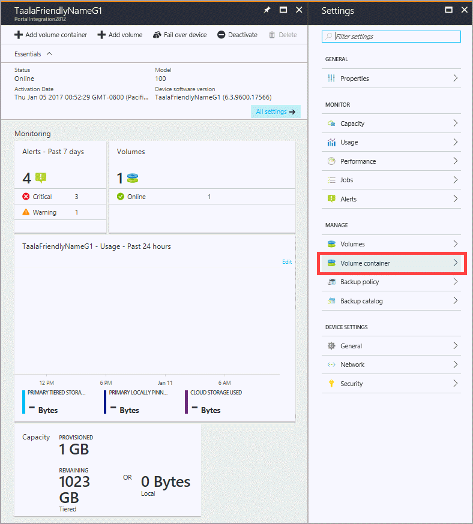
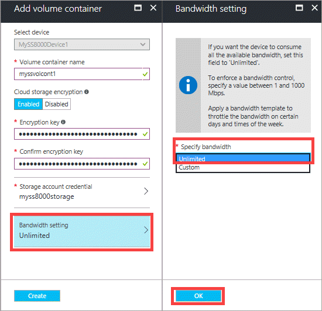

#### To create a volume container
1. Go to your StorSimple Device Manager service and click **Devices**. From the tabular listing of the devices, select and click a device. 

    

2. In the device dashboard, click **+ Add volume container**

    

3. In the **Add volume container** blade:
   
   1. The device is automatically selected.
   2. Supply a **Name** for your volume container. The name must be 3 to 32 characters long. You cannot rename a volume container once it is created.
   3. Select **Enable Cloud Storage Encryption** to enable encryption of the data sent from the device to the cloud.
   4. Provide and confirm a **Cloud Storage Encryption Key** that is 8 to 32 characters long. This key is used by the device to access encrypted data.
   5. Select a **Storage Account** to associate with this volume container. You can choose an existing storage account or the default account that is generated at the time of service creation. You can also use the **Add new** option to specify a storage account that is not linked to this service subscription.
   6. Select **Unlimited** in the **Specify bandwidth** drop-down list if you wish to consume all the available bandwidth. You can also set this option to **Custom** to employ bandwidth controls, and specify a value between 1 Mbps and 1,000 Mbps.
      If you have your bandwidth usage information available, you may be able to allocate bandwidth based on a schedule by specifying **Select a bandwidth template**. For a step-by-step procedure, go to [Add a bandwidth template](../articles/storsimple/storsimple-8000-manage-bandwidth-templates.md#add-a-bandwidth-template).

      
   7. Click **Create**.

        
   
       You are notified when the volume container is successfully created.

       

   The newly created volume container is listed in the list of volume containers for your device.

   

