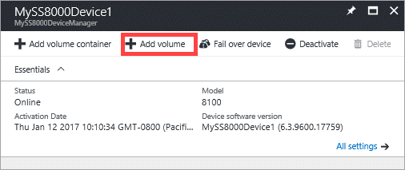
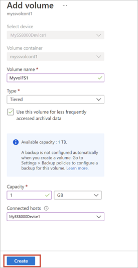

#### To create a volume
1. From the tabular listing of the devices in the **Devices** blade, select your device. Click **+ Add volume**.

    

2. In the **Add a volume** blade:
   
   1. The **Select device** field is automatically populated with your current device.

   2. From the drop-down list, select the volume container where you need to add a volume. 

   3. Type a **Name** for your volume. You cannot rename a volume once the volume is created.

   4. On the drop-down list, select the **Type** for your volume. For workloads that require local guarantees, low latencies, and higher performance, select a **Locally pinned** volume. For all other data, select a **Tiered** volume. If you are using this volume for archival data, check **Use this volume for less frequently accessed archival data**.
      
       A tiered volume is thinly provisioned and can be created quickly. Selecting **Use this volume for less frequently accessed archival data** for tiered volume targeted for archival data changes the deduplication chunk size for your volume to 512 KB. If this field is not checked, the corresponding tiered volume uses a chunk size of 64 KB. A larger deduplication chunk size allows the device to expedite the transfer of large archival data to the cloud.
       
       A locally pinned volume is thickly provisioned and ensures that the primary data on the volume stays local to the device and does not spill to the cloud.  If you create a locally pinned volume, the device checks for available space on the local tiers to provision the volume of the requested size. The operation of creating a locally pinned volume may involve spilling existing data from the device to the cloud and the time taken to create the volume may be long. The total time depends on the size of the provisioned volume, available network bandwidth, and the data on your device.

   5. Specify the **Provisioned Capacity** for your volume. Make a note of the capacity that is available based on the volume type selected. The specified volume size must not exceed the available space.
      
       You can provision locally pinned volumes up to 8.5 TB or tiered volumes up to 200 TB on the 8100 device. On the larger 8600 device, you can provision locally pinned volumes up to 22.5 TB or tiered volumes up to 500 TB. As local space on the device is required to host the working set of tiered volumes, creation of locally pinned volumes impacts the space available for provisioning tiered volumes. Therefore, if you create a locally pinned volume, space available for creation of tiered volumes is reduced. Similarly, if a tiered volume is created, the available space for creation of locally pinned volumes is reduced.
      
       If you provision a locally pinned volume of 8.5 TB (maximum allowable size) on your 8100 device, then you have exhausted all the local space available on the device. You can't create any tiered volume from that point onwards as there is no local space on the device to host the working set of the tiered volume. Existing tiered volumes also affect the space available. For example, if you have an 8100 device that already has tiered volumes of roughly 106 TB, only 4 TB of space is available for locally pinned volumes.

      1. In the **Connected hosts** field, click the arrow. 

         

      1. In the **Connected hosts** blade, choose an existing ACR or add a new ACR by performing the following steps:

         1. Supply a **Name** for your ACR.
         2. Under **iSCSI Initiator Name**, provide the iSCSI Qualified Name (IQN) of your Windows host. If you don't have the IQN, go to [Get the IQN of a Windows Server host](#get-the-iqn-of-a-windows-server-host).

      1. Click **Create**. A volume is created with the specified settings.

         

         > [!NOTE]
         > Be aware that the volume you have created here is not protected. You will need to create and associate backup policies with this volume to take scheduled backups. 

