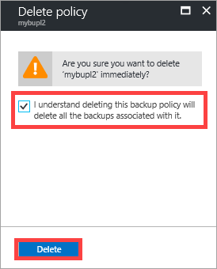
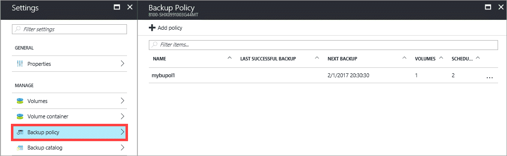

#### To delete a StorSimple backup policy

1. Go to your StorSimple device and click **Backup policy**.

2. In the tabular listing of backup policies, select the policy you want to delete. Right-click and from the context menu, select **Delete**.

    

3. You will be prompted for confirmation. Keep in mind that deleting a backup policy will delete all the associated backups. Click **Yes** to delete.

    

The backup policies list will be updated to display the new list of policies.

