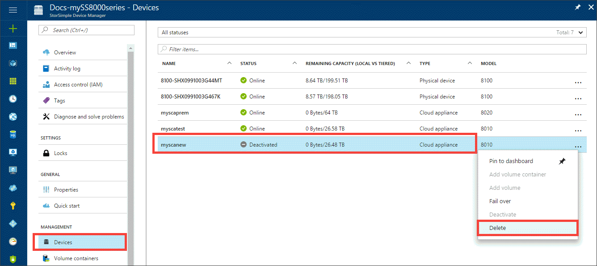
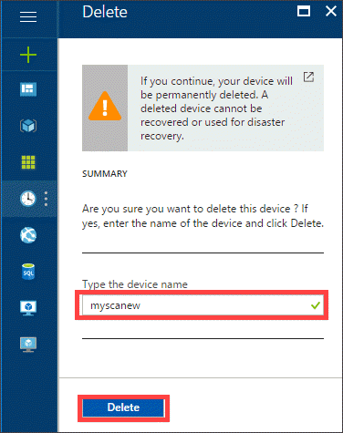
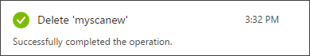
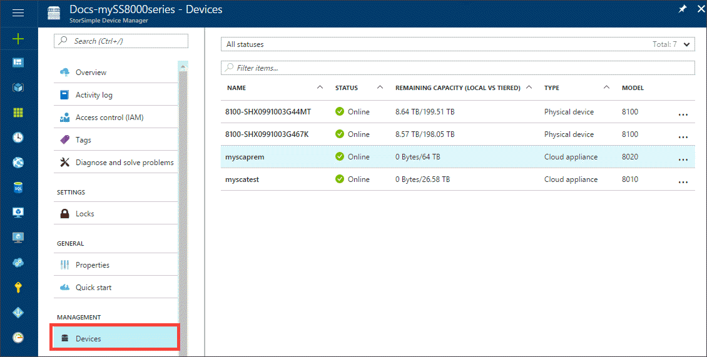

#### To delete a cloud appliance

1. Sign in to the Azure portal.
2. You can only delete a deactivated device that does not contain data. Delete the data on the device first or you can [fail over the data](../articles/storsimple/storsimple-8000-device-failover-cloud-appliance.md) in volume containers to another device. Once the data is deleted, you are ready to deactivate the device.
3. In your StorSimple Device Manager service page, click **Devices** and then select the device. Right-click and select **Deactivate**.
4. Once the device is deactivated, right-click the device and select **Delete**.

    

5. Type the device name to confirm the deletion. After the device is deleted, the device list updates.

    

6. You are notified after the device is deleted.

    

7. The list of devices updates to indicate the deleted device.

    
