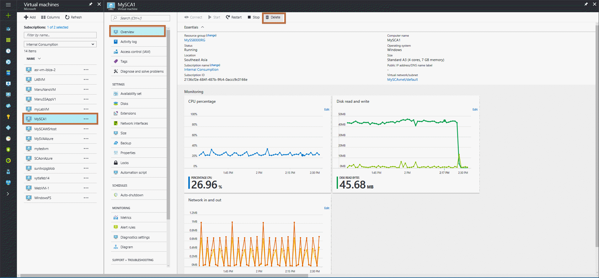
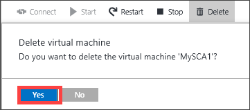

#### To delete a cloud appliance

1. Sign in to the Azure portal.
2. Click **Virtual Machines**, and then select the cloud appliance.

    

3. Click **Delete**. When prompted, confirm the deletion. You are notified after the device is deleted.

    