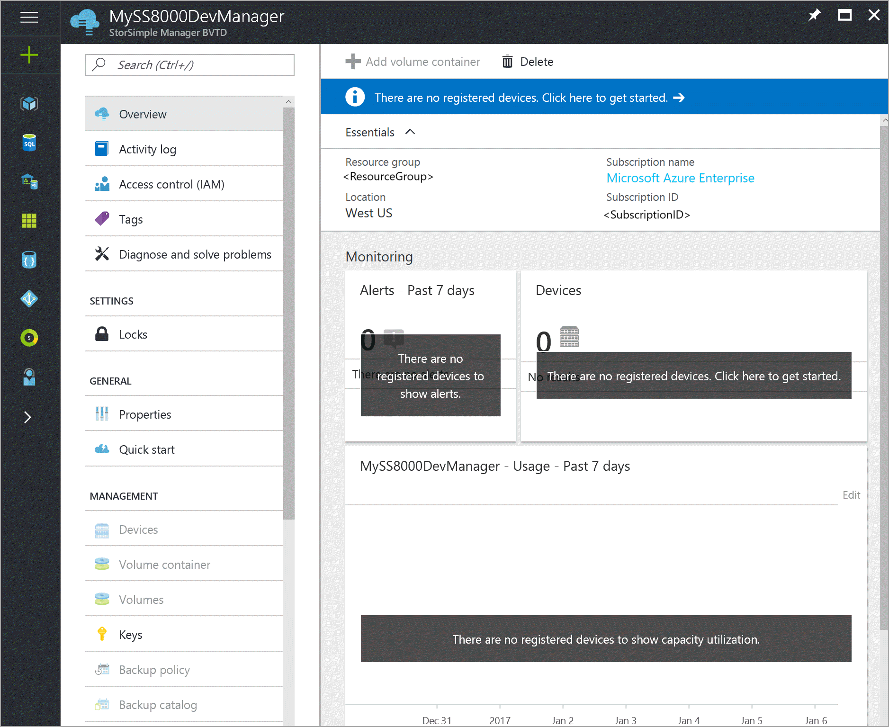
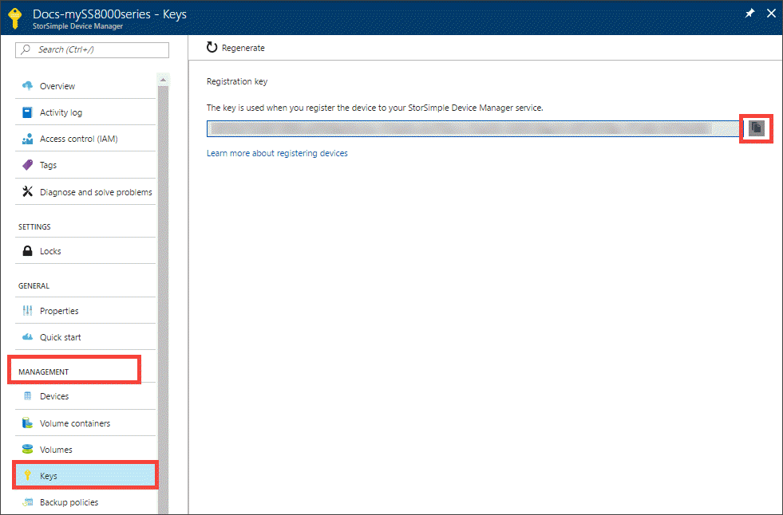

#### To get the StorSimple service registration key

1. On the **StorSimple Device Manager** blade, click the service that you created. This opens up a new blade to the right.
   
     

2.  Go to **Management > Keys**.
   
     

3.  In the blade that opens up, click the copy icon to copy the service registration key and save it for later use.

> [!NOTE]
> The service registration key is used to register all the devices that need to register with your StorSimple Device Manager service.

