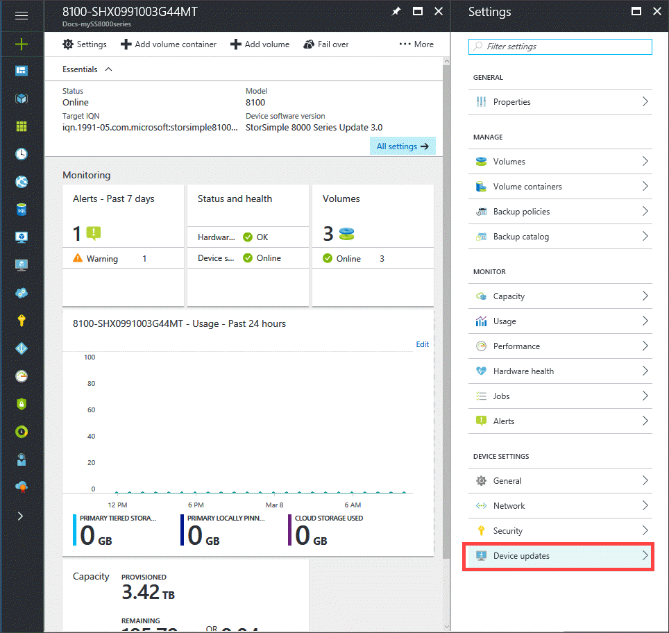
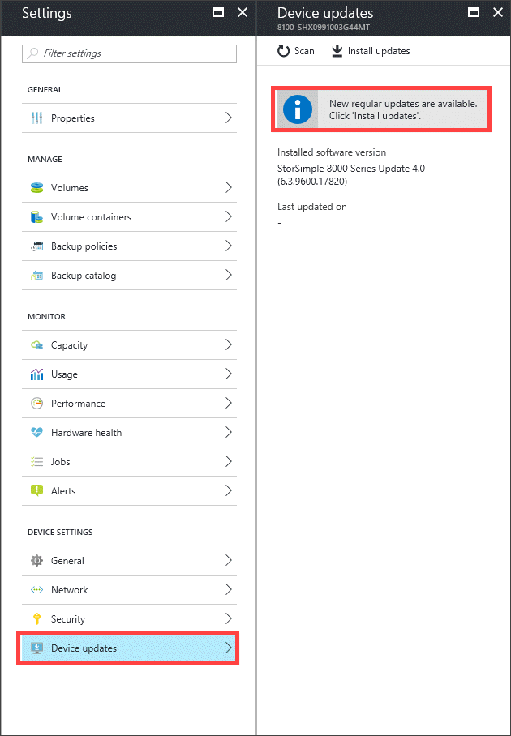
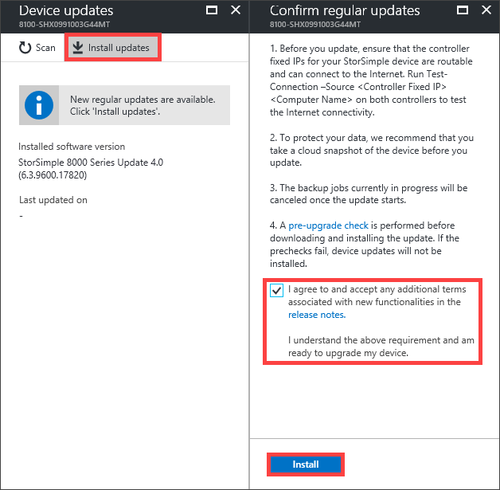
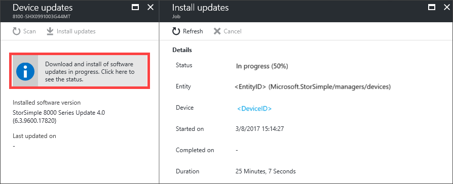

#### To install an update from the Azure portal

1. On the StorSimple service page, select your device.

    

2. Navigate to **Device settings** > **Device updates**.

    

2. A notification appears if new updates are available. Alternatively, in the **Device updates** blade, click **Scan Updates**. A job is created to scan for available updates. You are notified when the job completes successfully.

    

3. We recommend that you review the release notes before you apply an update on your device. To apply updates, click **Install updates**. In the **Confirm regular updates** blade, review the prerequisites to complete before you apply updates. Select the checkbox to indicate that you are ready to update the device and then click **Install**.

    

6. A set of prerequisite checks starts. These checks include:
   
   * **Controller health checks** to verify that both the device controllers are healthy and online.
   * **Hardware component health checks** to verify that all the hardware components on your StorSimple device are healthy.
   * **DATA 0 checks** to verify that DATA 0 is enabled on your device. If this interface is not enabled, you must enable it and then retry.

     The update is downloaded and installed only if all the checks are successfully completed. You are notified when the checks are in progress. If the prechecks fail, then you will be provided with the reasons for failure. Address those issues and then retry the operation. You may need to contact Microsoft Support if you cannot address these issues by yourself.

7. After the prechecks are successfully completed, an update job is created. You are notified when the update job is successfully created.
   
    
   
    The update is then applied on your device.

9. The update takes a few hours to complete. Select the update job and click **Details** to view the details of the job at any time.

    

     You can also monitor the progress of the update job from **Device settings > Jobs**. On the **Jobs** blade, you can see the update progress.

     

10. After the job is complete, navigate to the **Device settings > Device updates**. The software version should now be updated.

