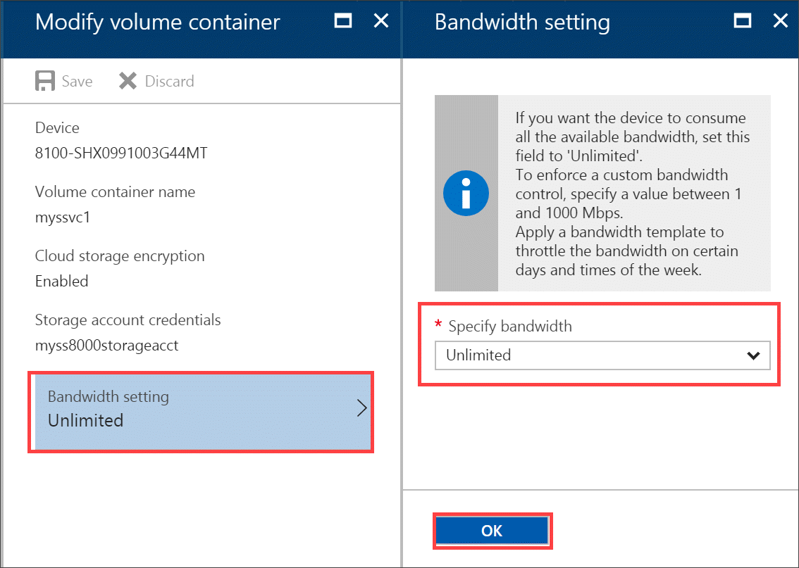
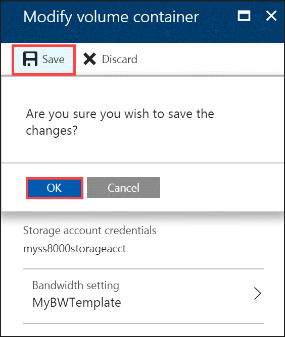

> [!NOTE] 
> You cannot modify the encryption settings and the storage account credentials associated with a volume container after it is created.

#### To modify a volume container

1. Go to your StorSimple Device Manager service and then navigate to **Management > Volume containers**.

2. From the tabular list of volume containers, select the volume container you want to modify. On the **Devices** page, select the device, double-click it, and then click the **Volume containers** tab.

2. In the tabular listing of the volume containers, select the volume container that you want to modify. In the blade that opens up, click **Modify** from the command bar.

    

3. In the **Modify Volume container** blade, do the following steps:
   
   1. The name, encryption key, and storage account associated with the volume container cannot be changed after they are specified. Change the associated bandwidth setting.
      
       

   2.  Click **OK**.
4. In the next page of the **Modify Volume Container** dialog box:
   
   1. From the drop-down list, choose an existing bandwidth template.
   2. Review the schedule settings for the specified bandwidth template.
   3. Click **Save** and confirm the changes.
      
       

   3. The **Volume containers** blade is updated to reflect the changes.

