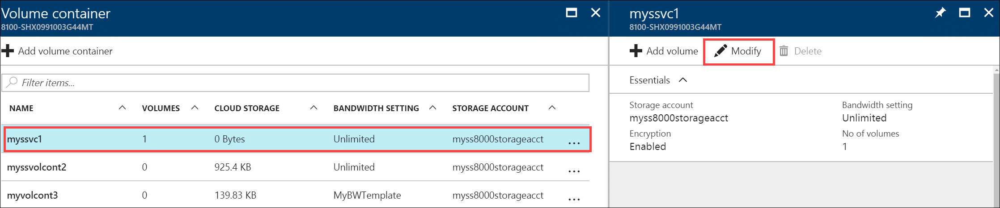
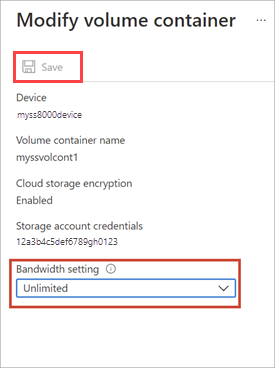
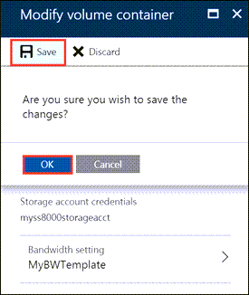

> [!NOTE] 
> You cannot modify the encryption settings and the storage account credentials associated with a volume container after it is created.

#### To modify a volume container

1. Go to your StorSimple Device Manager service, and then navigate to **Management > Volume containers**.

2. From the tabular list of volume containers, select the volume container you want to modify. On the **Devices** page, select the device, double-click it, and then click the **Volume containers** tab.

3. In the tabular listing of the volume containers, select the volume container that you want to modify. In the blade that opens up, click **Modify** from the command bar.

    

4. In the **Modify volume container** blade, do the following steps:
   
   1. The name, encryption key, and storage account associated with the volume container cannot be changed after they are specified. Change the associated bandwidth setting.<!--STEPS NEED WORK. Updated screen doesn't show alternative to Unlimited or subsequent steps if they customize bandwidth. Can we talk them through this (briefly)?-->
      
       <!--New graphic based on: modify-volume-container-bw-setting.png-->

   1.  Click **OK**.<!--If they choose Custom, do they still click OK, or are there more steps?-->

5. In the next page of the **Modify Volume Container** dialog box:<!--This step happens only if they choose Custom bandwidth? Are the steps similar to those in "Add volume container," step 3f, above?"-->
   
   1. From the drop-down list, choose an existing bandwidth template.
   1. Review the schedule settings for the specified bandwidth template.
   1. Click **Save** and confirm the changes.
      
       

      The **Volume containers** blade is updated to reflect the changes.
