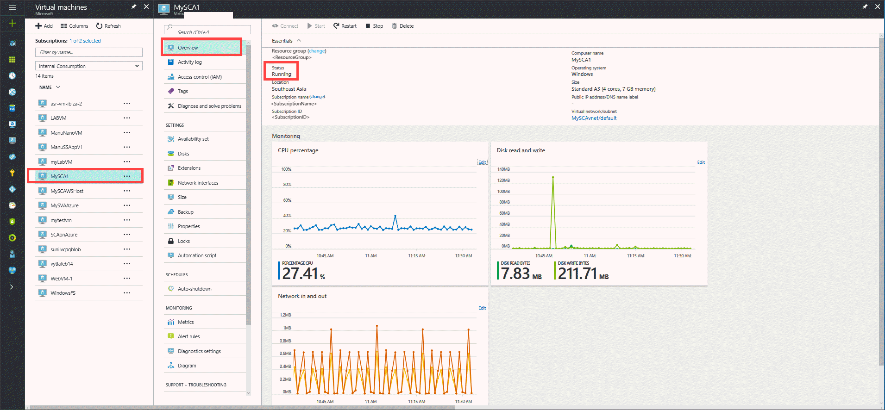
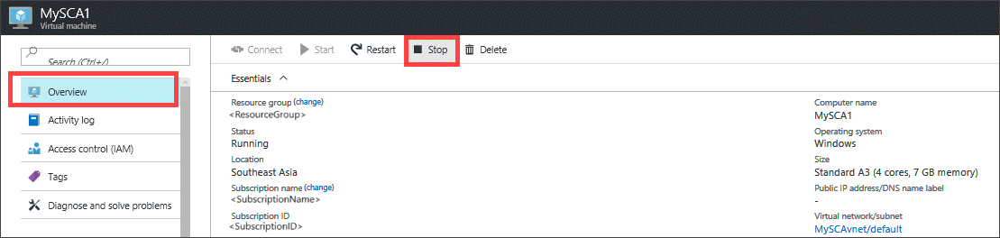
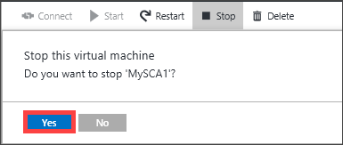
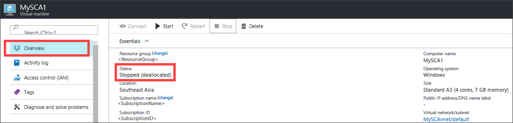
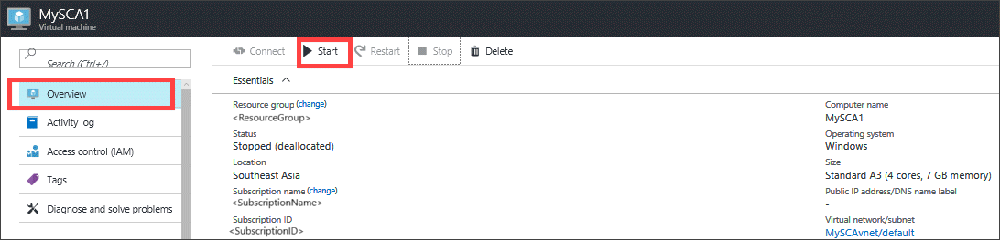
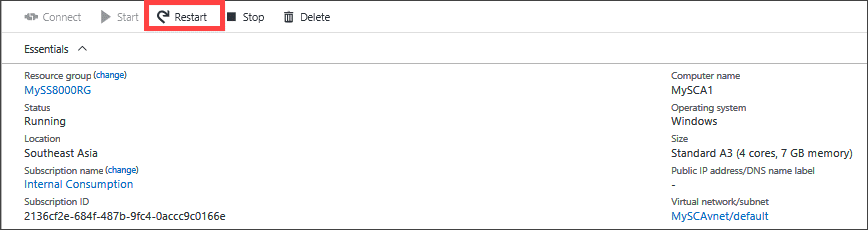

#### To stop and start a cloud appliance

1. To stop a cloud appliance, go to the VM for your cloud appliance.
    

2. From the command bar, click **Stop**.

    

3. When prompted for confirmation, click **Yes**.

    

4. When you stop a VM, it gets deallocated. While the cloud appliance is stopping, its status is **Deallocating**. After the cloud appliance is stopped, its status is **Stopped (deallocated)**.

    

5. Once a VM is stopped, click **Start** (button becomes available) to start the VM. After the cloud appliance has started up, its status is **Started**.

    

Use the following cmdlets to stop and start a cloud appliance.

`Stop-AzureVM -ServiceName "MyStorSimpleservice1" -Name "MyStorSimpleDevice"`

`Start-AzureVM -ServiceName "MyStorSimpleservice1" -Name "MyStorSimpleDevice"`

#### To restart a cloud appliance

To restart a cloud appliance, go to the VM for your cloud appliance. From the command bar, click **Restart**. When prompted, confirm the restart. When the cloud appliance is ready for you to use, its status is **Running**.

Use the following cmdlet to restart a cloud appliance.

`Restart-AzureVM -ServiceName "MyStorSimpleservice1" -Name "MyStorSimpleDevice"`

