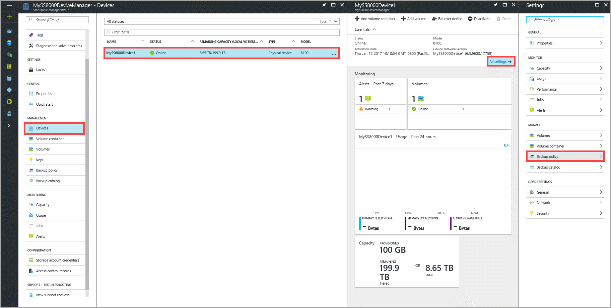
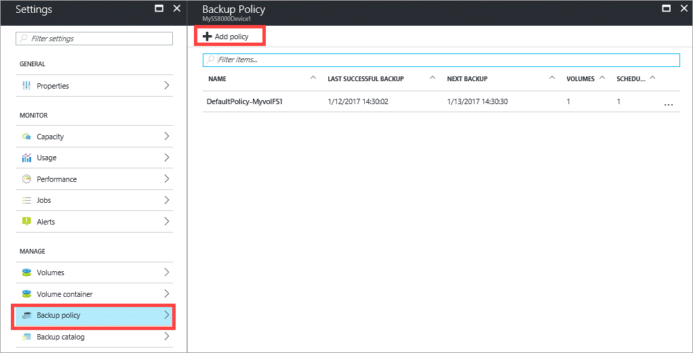
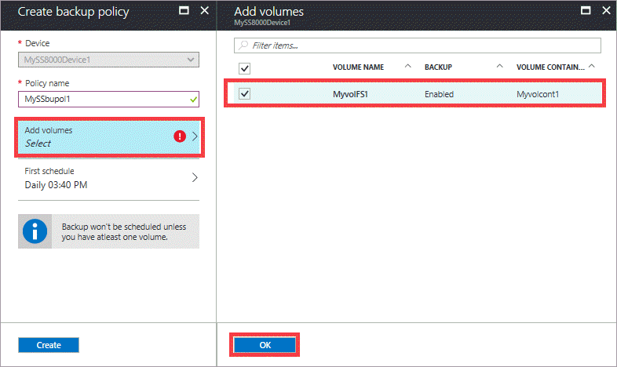
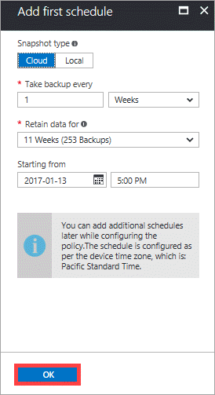
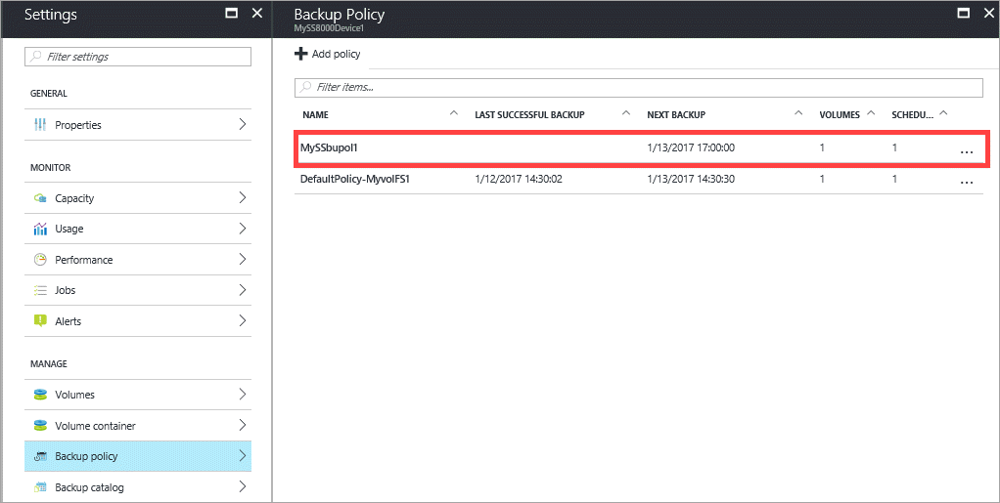

### To take a backup

1. Go to your StorSimple Device Manager service. From the tabular listing of devices, select and click your device and then click **All settings**. In the **Settings** blade, go to **Settings > Manage > Backup policy**.

    

2. In the **Backup policy** blade, click **+ Add policy**.

    

3. In the **Create backup policy** blade, supply a name that contains between 3 and 150 characters for your backup policy.

4. Select the volumes to be backed up. If you select more than one volume, these volumes are grouped together to create a crash-consistent backup.

    

5. On **Add first schedule** blade:

    1. Select the type of backup. For faster restores, select **Local** snapshot. For data resiliency, select **Cloud** snapshot.
    2. Specify the backup frequency in minutes, hours, days, or weeks.
    3. Select a retention time. The retention choices depend on the backup frequency. For example, for a daily policy, the retention can be specified in weeks, whereas retention for a monthly policy is in months.
    4. Select the starting time and date for the backup policy.
    5. Click **OK** to create the backup policy.

         

6. Click **Create** to start the backup policy creation. You are notified when the backup policy is successfully created. The list of backup policies is also updated.
      
      
      
      You now have a backup policy that creates scheduled backups of your volume data.

