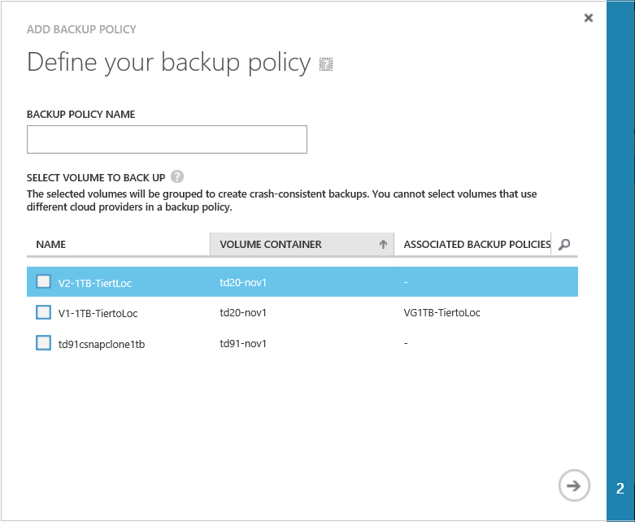
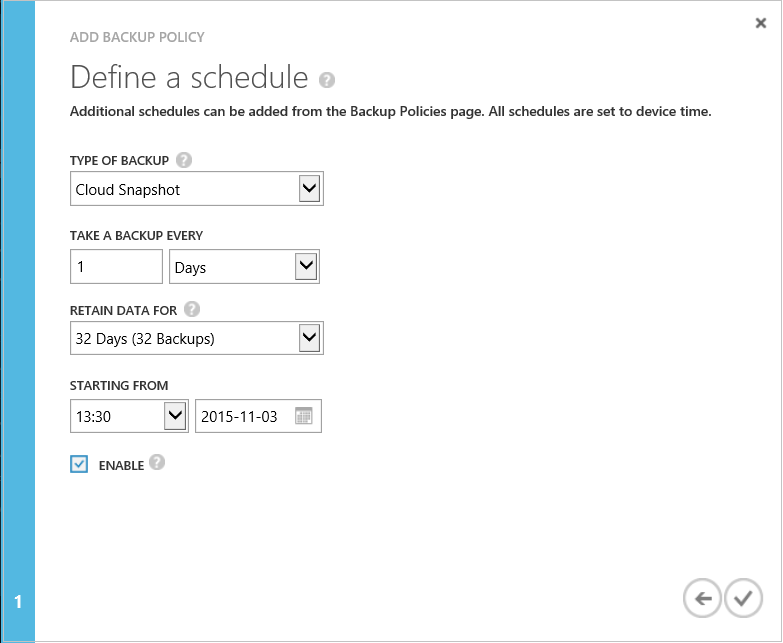

<!--author=v-sharos last changed: 11/06/15-->

#### To add a StorSimple backup policy
1. On the device **Quick Start** page, click the **Backup Policies** tab. This will take you to the **Backup Policies** page.
2. At the bottom of the page, click **Add** to start the Add Backup Policy wizard.
   
    
3. In the **Add Backup Policy** dialog box, under **Define your backup policy**, do the following:
   
   1. Specify a backup policy name that contains between 3 and 150 characters.
   2. Click the check box(es) to assign one or more volumes to this backup policy. Note that you cannot select volumes that use different cloud service providers. If you are using multiple cloud service providers, based on your first selection, the list will show volumes belonging to only that cloud service provider. This will allow you to group volumes belonging to a single cloud service provider in a snapshot.
   3. Click the arrow icon  to go to the next page.
      
      
4. Under **Define a schedule**, do the following:
   
   1. In the **Type of Backup** box, select **Cloud Snapshot** or **Local Snapshot** from the drop-down list.
   2. Indicate the frequency of backups (specify a number and then choose **Days** or **Weeks** from the drop-down list).
   3. Enter a retention schedule.
   4. Enter a time and date for the backup policy to begin.  
   5. Click the check icon  to save the policy.

The newly added policy will be displayed in the tabular view on the **Backup Policies** page.

