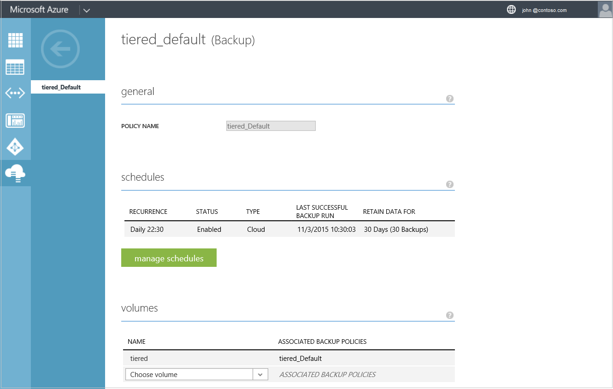
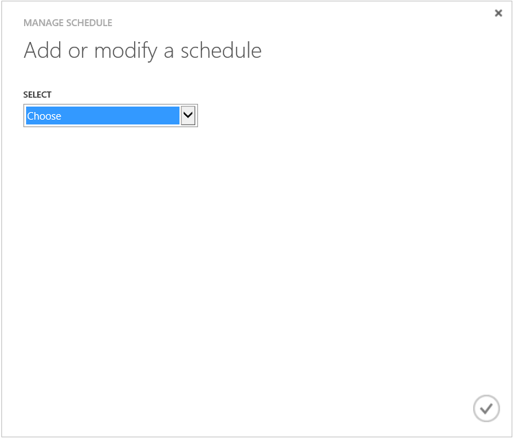
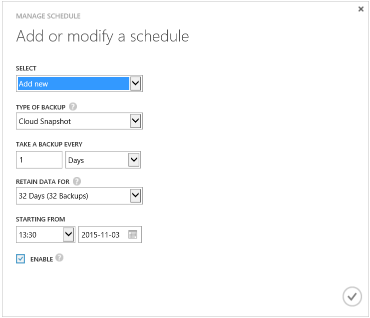

<!--author=SharS last changed: 11/04/15-->

#### To add or modify a StorSimple backup schedule

1. On the device **Quick Start** page, click the **Backup Policies** tab. This will take you to the **Backup Policies** page.

2. In the tabular listing of the policies, select and click the policy that you want to edit.

3. Under **General**, you can modify the backup policy name.

     

4. Click **Manage Schedules**. 

5. In the **Manage Schedule** dialog box, under **Add or Modify a schedule**, do the following:

    1. From the drop-down list, choose an existing schedule or select **Add** to create a new schedule.
    2. Click the check icon . 

        

    2. Select the type of backup as local or cloud snapshot.

         

    3. Specify the backup frequency, retention, and starting time for the schedule.

    4. Select the check box to enable or disable the schedule.

    5. Click the check icon  to save the schedule.

5. In the **Volumes** section, choose the volumes that this policy will be applied to.

6. At the bottom of the page, click **Save** to save the changes to this policy.

7. You will prompted for confirmation. Click **Yes** to save the policy.

The **Backup Policies** page will be updated to save the changes to the policy.
 

