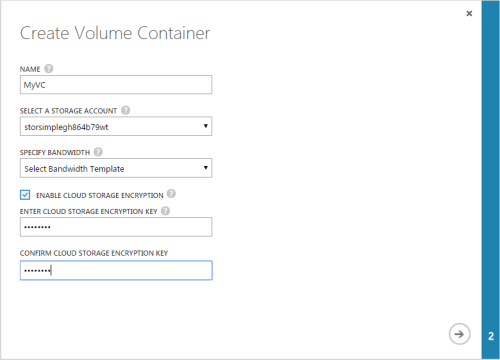
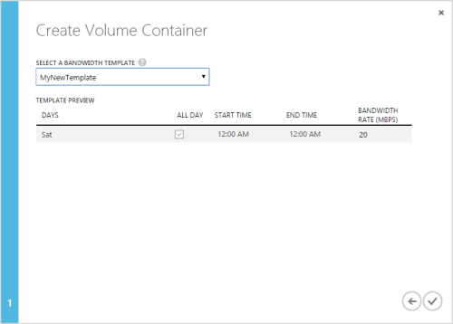

<properties 
   pageTitle="Add a volume container"
   description="Explains how you can use the StorSimple Manager service volume containers page to add a volume container."
   services="storsimple"
   documentationCenter="NA"
   authors="SharS"
   manager="carolz"
   editor="" />
<tags 
   ms.service="storsimple"
   ms.devlang="NA"
   ms.topic="article"
   ms.tgt_pltfrm="NA"
   ms.workload="TBD"
   ms.date="08/14/2015"
   ms.author="v-sharos" />

#### To add a volume container

1. On the **Devices** page, select the device, double-click it, and then click the **Volume containers** tab.

2. Click **Add** at the bottom of the page. In the **Create volume container** dialog box, do the following:

  1. Supply a unique **Name** for your volume container. This name can contain a maximum of 32 characters.
  2. Select a **Storage Account** to be associated with this volume container. You can choose from an existing storage account within the same subscription or select **Add more** to select a storage account from another subscription. You can also choose the storage account that was first generated when the service was created.
  3. Specify bandwidth as **Unlimited** if you want to consume all available bandwidth, or **Custom** to employ bandwidth controls. For a custom bandwidth, supply a value between 1 and 1000 Mbps. To allocate bandwidth based on a schedule, you can **Select a bandwidth template**.
  4. We recommend that you keep **Enable Cloud Storage Encryption** selected to encrypt the data that is going to the cloud. Disable encryption only if you are employing other means to encrypt your data.
  5. Provide a **Cloud Storage Encryption Key** that contains between 8 and 32 characters. The device uses this key to access the encrypted data. In the **Confirm Cloud Storage Encryption Key** field, enter the cloud storage encryption key again to confirm it.
  6. Click the arrow to proceed to the next page.

     

3. If you specified **Select a bandwidth template**, choose from the drop-down list of existing bandwidth templates. Review the schedule settings and click the check icon .

     

The volume container will be saved and the newly created volume container will be listed on the **Volume container** page.
 
