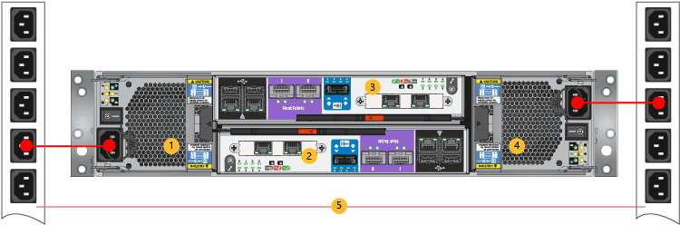

<properties 
   pageTitle="Cable your StorSimple 8100 for power | Microsoft Azure"
   description="Explains how to attach the power cables and then turn on a StorSimple 8100 device for the first time."
   services="storsimple"
   documentationCenter=""
   authors="alkohli"
   manager="carolz"
   editor="" />
<tags 
   ms.service="storsimple"
   ms.devlang="NA"
   ms.topic="article"
   ms.tgt_pltfrm="NA"
   ms.workload="TBD"
   ms.date="08/06/2015"
   ms.author="alkohli" />

#### To cable for power

1. Make sure that the power switches on each of the Power and Cooling Modules (PCMs) are in the OFF position.

2. Connect the power cords to each of the PCMs in the primary enclosure.

3. Attach the power cords to the rack power distribution units (PDUs) as shown in the following image. Make sure that the two PCMs use separate power sources.

    >[AZURE.IMPORTANT] To ensure high availability for your system, we recommend that you strictly adhere to the power cabling scheme shown in the following diagram. 

    

    **Power cabling on an 8100 device**

    |Label|Description|
    |:----|:----------|
    |1|PCM 0|
    |2|Controller 1|
    |3|Controller 0|
    |4|PCM 1|
    |5|PDUs|

4. To turn on the system, flip the power switches on both PCMs to the ON position.
