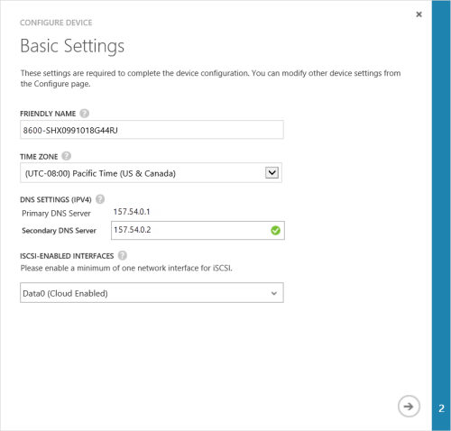
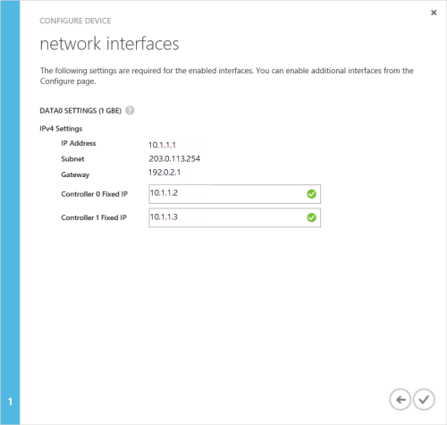

<properties 
   pageTitle="Complete minimum device setup"
   description="Describes how to complete the minimum StorSimple device configuration."
   services="storsimple"
   documentationCenter="NA"
   authors="SharS"
   manager="adinah"
   editor="tysonn" />
<tags 
   ms.service="storsimple"
   ms.devlang="NA"
   ms.topic="article"
   ms.tgt_pltfrm="NA"
   ms.workload="TBD"
   ms.date="05/21/2015"
   ms.author="v-sharos" />

#### To complete the minimum StorSimple device setup

1. Select the device and click **Quick Start**. Click **Complete device setup** to start the Configure device wizard.

2. In the Configure device wizard **Basic Settings** dialog box, do the following:
  1. Supply a **friendly name** for your device. The default device name reflects information such as the device model and serial number. You can assign a friendly name of up to 64 characters to manage your device.
  2. Set the **time zone** based on the geographic location in which the device is being deployed. Your device will use this time zone for all scheduled operations.
  3. Under **DNS Settings**, provide an address for your **Secondary DNS Server**. If you are using IPv6, the field will be populated based on the IPv6 prefix provided in the Windows PowerShell interface. 
  If the secondary DNS server is not configured, you will not be allowed to save your device configuration.
  4. Under iSCSI enabled interfaces, enable at least one network for iSCSI. At least one network interface needs to be cloud-enabled and one interface needs to be iSCSI-enabled. DATA 0 is automatically cloud-enabled.
 
      

3. Click the arrow icon. 

4. In the **Network Interfaces** dialog box, provide the fixed IP addresses for Controller 0 and Controller 1. **The controller fixed IP addresses need to be free IPs within the subnet accessible by the device IP address.** If the DATA 0 interface was configured for IPv4, the fixed IP addresses need to be provided in the IPv4 format. If you provided a prefix for IPv6 configuration, the fixed IP addresses will be populated automatically in these fields.

    

    The fixed IP addresses for the controller are used for servicing the updates to the device, and therefore the fixed IPs must be routable and able to connect to the Internet. You can check that your fixed controller IPs are routable by using the [Test-HcsmConnection][Test] cmdlet. The following example shows fixed controller IPs are routed to the Internet and can access the Microsoft Update servers. 

     

5. Click the check icon .
  You will return to the device **Quick Start** page.

 > [AZURE.NOTE] You can modify all the other device settings at any time by accessing the **Configure** page.

<!--Link reference-->
[Test]: https://technet.microsoft.com/library/dn715782(v=wps.630).aspx