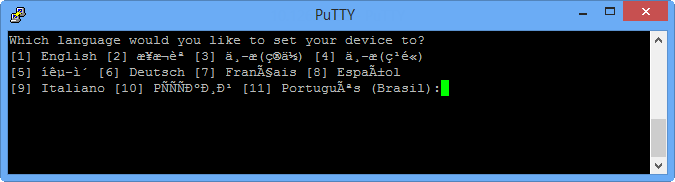
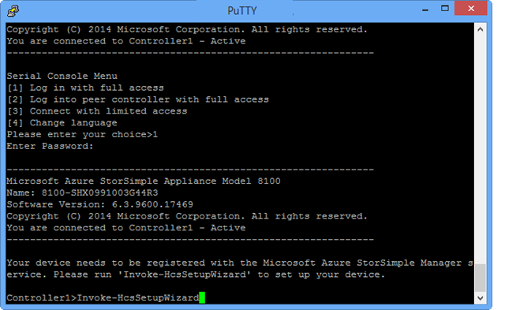
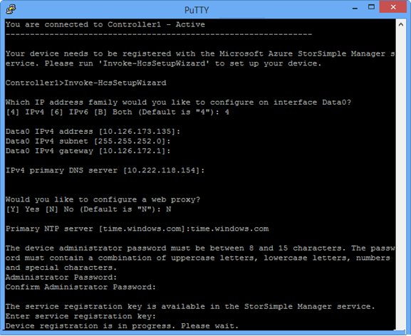
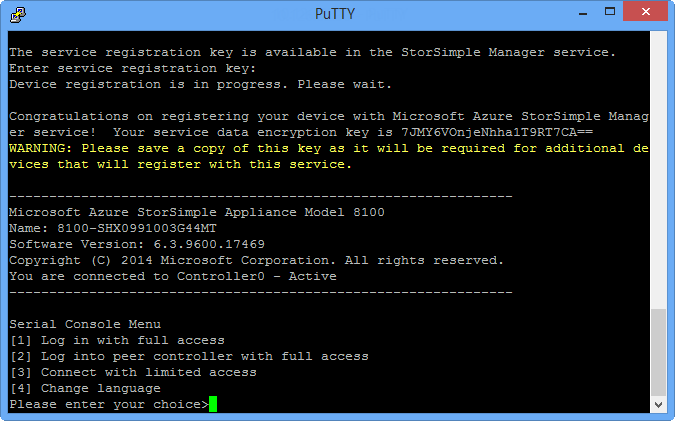

<properties 
   pageTitle="Configure and register your device"
   description="Explains how to use Windows PowerShell for StorSimple to configure and register a StorSimple device that is running Update 1."
   services="storsimple"
   documentationCenter="NA"
   authors="alkohli"
   manager="adinah"
   editor="tysonn" />
<tags 
   ms.service="storsimple"
   ms.devlang="NA"
   ms.topic="article"
   ms.tgt_pltfrm="NA"
   ms.workload="TBD"
   ms.date="05/22/2015"
   ms.author="alkohli" />


### To configure and register the device

1. Access the Windows PowerShell interface on your StorSimple device serial console. See [Use PuTTY to connect to the device serial console](#use-putty-to-connect-to-the-device-serial-console) for instructions. **Be sure to follow the procedure exactly or you will not be able to access the console.**

2. In the session that opens up, press Enter one time to get a command prompt. 

3. You will be prompted to choose the language that you would like to set for your device. Specify the language, and then press Enter. 

    

4. In the serial console menu that is presented, choose option 1 to log on with full access. 

    
  
5. Perform the following steps to configure the minimum required network settings for your device.

    > [AZURE.IMPORTANT] These configuration steps need to be performed on the active controller of the device. The serial console menu indicates the controller state in the banner message. If you are not connect to the active controller, disconnect and then connect to the active controller.

      1. At the command prompt, type your password. The default device password is **Password1**.

      2. Type the following command:

           `Invoke-HcsSetupWizard`

      3. A setup wizard will appear to help you configure the network settings for the device. Supply the following information: 

       - IP address for DATA 0 network interface
       - Subnet mask
       - Gateway
       - IP address for Primary DNS server
       - IP address for Primary NTP server
 
        > [AZURE.NOTE] You may have to wait for a few minutes for the subnet mask and DNS settings to be applied. 

      4. Optionally, configure your web proxy server.

      > [AZURE.IMPORTANT] Although web proxy configuration is optional, be aware that if you use a web proxy, you can only configure it here. For more information, go to [Configure web proxy for your device](https://msdn.microsoft.com/library/azure/dn764937.aspx). 

6. Press Ctrl + C to exit the setup wizard.
 
7. Install the updates as follows:
      1. Use the following cmdlet to set IPs on both the controllers:

         `Set-HcsNetInterface -InterfaceAlias Data0 -Controller0IPv4Address <Controller0 IP> -Controller1IPv4Address <Controller1 IP>`

      2. At the command prompt, run `Get-HcsUpdateAvailability`. You should be notified that updates are available.

      3. Run `Start-HcsUpdate`. You can run this command on any node. Updates will be applied on the first controller, the controller will fail over, and then the updates will be applied on the other controller.

      You can monitor the progress of the update by running `Get-HcsUpdateStatus`.    

       The following sample output shows the update in progress.
  
        ````
        Controller0>Get-HcsUpdateStatus
        RunInprogress       : True
        LastHotfixTimestamp : 4/13/2015 10:56:13 PM
        LastUpdateTimestamp : 4/13/2015 10:35:25 PM
        Controller0Events   :
        Controller1Events   : 
        ````
 
     The following sample output indicates that the update is finished.

        ````
        Controller1>Get-HcsUpdateStatus

        RunInprogress       : False
        LastHotfixTimestamp : 4/13/2015 10:56:13 PM
        LastUpdateTimestamp : 4/13/2015 10:35:25 PM
        Controller0Events   :
        Controller1Events   :

      It may take up to 11 hours to apply all the updates, including the Windows Updates.

8. After all the updates are successfully installed, run the following cmdlet to confirm that the software updates were applied correctly:

     `Get-HcsSystem`

    You should see the following versions:
    - HcsSoftwareVersion: 6.3.9600.17491
    - CisAgentVersion: 1.0.9037.0
    - MdsAgentVersion: 26.0.4696.1433
 
9. Run the following cmdlet to confirm that the firmware update was applied correctly:

    `Start-HcsFirmwareCheck`.

     The firmware status should be **UpToDate**.

10. Run the following cmdlet to point the device to the Microsoft Azure Government portal (because it points to the public Azure Management Portal by default). This will restart both controllers. We recommend that you use two PuTTY sessions to simultaneously connect to both controllers so that you can see when each controller is restarted.

     `Set-CloudPlatform -AzureGovt_US`

    You will see a confirmation message. Accept the default (**Y**).

11. Run the following cmdlet to resume setup:

     `Invoke-HcsSetupWizard`

     

    When you resume setup, the wizard will be the Update 1 version (which corresponds to version 17469). 

12. Accept the network settings. You will see a validation message after you accept each setting.
 
13. For security reasons, the device administrator password expires after the first session, and you will need to change it now. When prompted, provide a device administrator password. A valid device administrator password must be between 8 and 15 characters. The password must contain three of the following: lowercase, uppercase, numeric, and special characters.

	<br/>

14. The final step in the setup wizard registers your device with the StorSimple Manager service. For this, you will need the service registration key that you obtained in [Step 2: Get the service registration key](storsimple-get-service-registration-key-gov.md). After you supply the registration key, you may need to wait for 2-3 minutes before the device is registered.

      > [AZURE.NOTE] You can press Ctrl + C at any time to exit the setup wizard. If you have entered all the network settings (IP address for Data 0, Subnet mask, and Gateway), your entries will be retained.

	

15. After the device is registered, a Service Data Encryption key will appear. Copy this key and save it in a safe location. **This key will be required with the service registration key to register additional devices with the StorSimple Manager service.** Refer to [StorSimple security](../articles/storsimple/storsimple-security.md) for more information about this key.
	
	    

      > [AZURE.IMPORTANT] To copy the text from the serial console window, simply select the text. You should then be able to paste it in the clipboard or any text editor. 
      > 
      > DO NOT use Ctrl + C to copy the service data encryption key. Using Ctrl + C will cause you to exit the setup wizard. As a result, the device administrator password will not be changed and the device will revert to the default password.

16. Exit the serial console.

17. Return to the Government Portal, and complete the following steps:
  1. Double-click your StorSimple Manager service to access the **Quick Start** page.
  2. Click **View connected devices**.
  3. On the **Devices** page, verify that the device has successfully connected to the service by looking up the status. The device status should be **Online**.
   
    	 
  
        If the device status is **Offline**, wait for a couple of minutes for the device to come online. 
      
        If the device is still offline after a few minutes, then you need to make sure that your firewall network was configured as described in the [network requirements for your StorSimple device](https://msdn.microsoft.com/library/dn772371.aspx). If you do not have HTTP 1.1 support, check port 9354 to make sure that it is open for outbound communication. This port is used for communication between the StorSimple Manager service and your StorSimple device.
     
        
