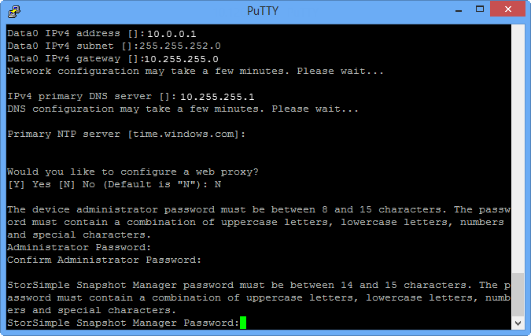
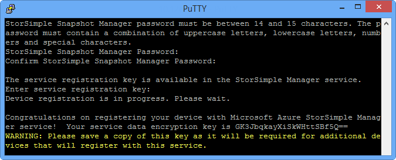
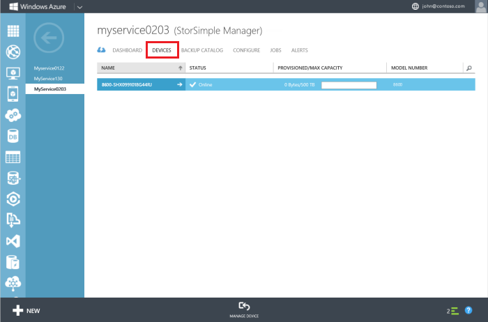

<properties 
   pageTitle="Configure and register your device"
   description="Explains how to use Windows PowerShell for StorSimple to configure and register your device."
   services="storsimple"
   documentationCenter="NA"
   authors="SharS"
   manager="adinah"
   editor="tysonn" />
<tags 
   ms.service="storsimple"
   ms.devlang="NA"
   ms.topic="article"
   ms.tgt_pltfrm="NA"
   ms.workload="TBD"
   ms.date="08/05/2015"
   ms.author="v-sharos" />

#### To configure and register the device

1. Access the Windows PowerShell interface on your StorSimple device serial console. See [Use PuTTY to connect to the device serial console](#use-putty-to-connect-to-the-device-serial-console) for instructions. **Be sure to follow the procedure exactly or you will not be able to access the console.**

2. In the session that opens up, press Enter one time to get a command prompt. 

3. You will be prompted to choose the language that you would like to set for your device. Specify the language, and then press Enter. 

    

4. In the serial console menu that is presented, choose option 1 to log on with full access. 

    
  
     Complete steps 5-12 to configure the minimum required network settings for your device. **These configuration steps need to be performed on the active controller of the device.** The serial console menu indicates the controller state in the banner message. If you are not connected to the active controller, disconnect and then connect to the active controller.

5. At the command prompt, type your password. The default device password is **Password1**.

6. Type the following command:

     `Invoke-HcsSetupWizard` 

7. A setup wizard will appear to help you configure the network settings for the device. Supply the the following information: 
   - IP address for the DATA 0 network interface
   - Subnet mask
   - Gateway
   - IP address for Primary DNS server
   - IP address for Primary NTP server
   
      > [AZURE.NOTE] You may have to wait for a few minutes for the subnet mask and the DNS settings to be applied. If you get a "The device is not ready." error message, check the physical network connection on the DATA 0 network interface of your active controller.

8. (Optional) configure your web proxy server. Although web proxy configuration is optional, **be aware that if you use a web proxy, you can only configure it here**. For more information, go to [Configure web proxy for your device](https://msdn.microsoft.com/library/azure/dn764937.aspx). If you run into any issues during this step, refer to troubleshooting guidance for [Errors during web proxy configuration](storsimple-troubleshoot-deployment.md#errors-during-the-optional-web-proxy-settings).
 

      > [AZURE.NOTE] You can press Ctrl + C at any time to exit the setup wizard. Any settings that you applied before you issued this command will be retained.

9. For security reasons, the device administrator password expires after the first session, and you will need to change it for subsequent sessions. When prompted, provide a device administrator password. A valid device administrator password must be between 8 and 15 characters. The password must contain a combination of lowercase characters, uppercase characters, numbers, and special characters.

10. The StorSimple Snapshot Manager password is also set here. You use this password when you authenticate a device with your Windows host running StorSimple Snapshot Manager. When prompted, provide a 14 to 15 character password. The password must contain a combination of three of the following: lowercase, uppercase, numeric, and special characters. 

    

    You can reset the StorSimple Snapshot Manager password from the StorSimple Manager service interface. For detailed steps, go to [Change the StorSimple passwords using the StorSimple Manager serivce](storsimple-change-passwords.md).

	To troubleshoot any issues during this step, refer to troubleshooting guidance for [Errors related to passwords](storsimple-troubleshoot-deployment.md#errors-related-to-device-administrator-and-storsimple-snapshot-manager-passwords).

11. The final step in the setup wizard registers your device with the StorSimple Manager service. For this, you will need the service registration key that you obtained in step 2. After you supply the registration key, you may need to wait for 2-3 minutes before the device is registered.

	To troubleshoot any possible device registration failures, refer to [Errors during device registration](storsimple-troubleshoot-deployment.md#errors-during-device-registration). For detailed troubleshooting, you can also refer to [Step-by-step troubleshooting example](storsimple-troubleshoot-deployment.md#step-by-step-storsimple-troubleshooting-example).

12. After the device is registered, a Service Data Encryption key will appear. Copy this key and save it in a safe location.
	
	> [AZURE.WARNING] This key will be required with the service registration key to register additional devices with the StorSimple Manager service. Refer to [StorSimple security](../articles/storsimple/storsimple-security.md) for more information about this key.

     

     To copy the text from the serial console window, simply select the text. You should then be able to paste it in the clipboard or any text editor. DO NOT use Ctrl + C to copy the service data encryption key. Using Ctrl + C will cause you to exit the setup wizard. As a result, the device administrator password and the StorSimple Snapshot Manager password will not be changed and the device will revert to the default passwords.

13. Exit the serial console.

14. Return to the Management Portal, and complete the following steps:
  1. Double-click your StorSimple Manager service to access the **Quick Start** page.
  2. Click **View connected devices**.
  3. On the **Devices** page, verify that the device has successfully connected to the service by looking up the status. The device status should be **Online**. If the device status is **Offline**, wait for a couple of minutes for the device to come online.
   
     
  
      > [AZURE.IMPORTANT] After the device is online, plug in the network cables that you had unplugged in the beginning of this step.

After the device is successfully registered and doesn't come online, you can run the `Test-HcsmConnection -Verbose` to ensure that the network connectivity is healthy. For the detailed usage of this cmdlet, go to [cmdlet reference for Test-HcsmConnection](https://technet.microsoft.com/library/dn715782.aspx).
