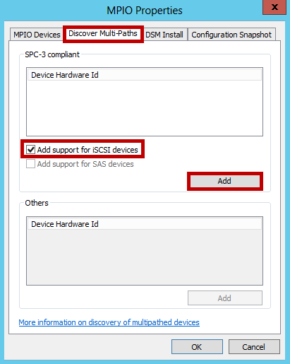
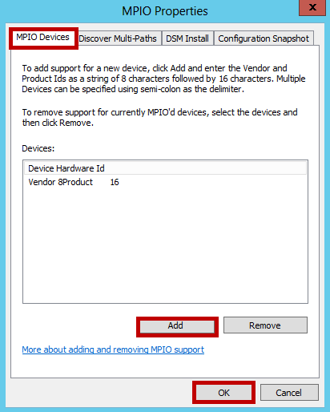

#### To configure MPIO for StorSimple volumes

1. Open the **MPIO configuration**. Click **Server Manager > Dashboard > Tools > MPIO**.

2. In the **MPIO Properties** dialog box, select the **Discover Multi-Paths** tab.

3. Select **Add support for iSCSI devices**, and then click **Add**.  

	

4. Reboot the server when prompted.
5. In the **MPIO Properties** dialog box, click the **MPIO Devices** tab. Click **Add**.

	