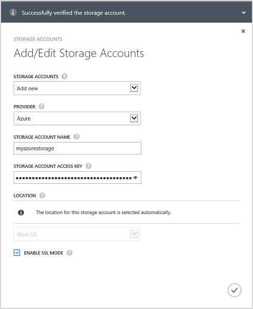
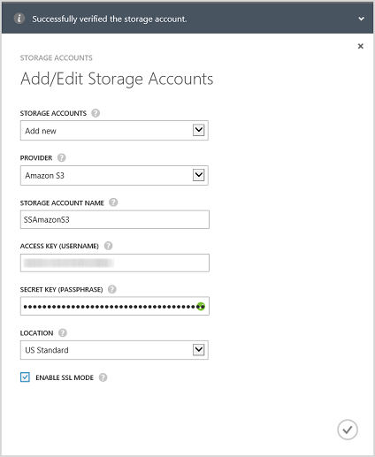
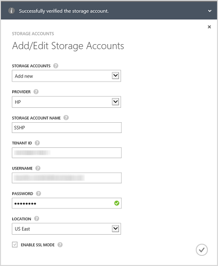
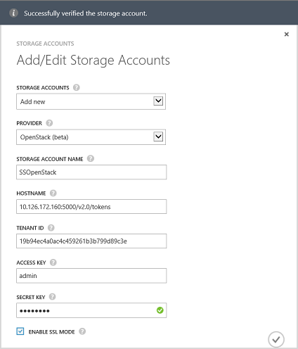

<properties 
   pageTitle="Optional: Configure a new storage account for the service"
   description="Explains how to configure a storage account for the StorSimple Manager service running Update 1."
   services="storsimple"
   documentationCenter="NA"
   authors="alkohli"
   manager="carolz"
   editor="" />
<tags 
   ms.service="storsimple"
   ms.devlang="NA"
   ms.topic="article"
   ms.tgt_pltfrm="NA"
   ms.workload="TBD"
   ms.date="08/14/2015"
   ms.author="alkohli" />

#### To add a storage account in StorSimple 8000 Series Update 1.0

1. On the StorSimple Manager service landing page, select your service and double-click it. This will take you to the **Quick Start** page. Select the **Configure** page.

2. Click **Add/edit storage account**.

3. In the **Add/Edit Storage Account** dialog box, click **Add new**.

4. In the **Provider** field, select the appropriate cloud service provider. The supported providers are Azure, Amazon S3, Amazon S3 with RRS, HP and OpenStack. Specify the credentials and the location associated with the storage account of your cloud service providers. The fields presented for credentials will be different depending upon the cloud service provider you have specified. 
  - If you have selected Azure as your cloud service provider, supply the **Name** and the primary **Access Key** for your Microsoft Azure storage account. For an Azure account, the location will be automatically populated.

        

 - If you have selected Amazon S3 or Amazon S3 with RRS, provide a friendly **Storage Account name**, **Access Key**, and **Secret Key**. For Amazon S3 and Amazon S3 with RRS, the following locations are supported:

		- US Standard
		- US West (Oregon)
		- US West (Northern California)
		- EU (Ireland)
		- Asia Pacific (Singapore)
		- Asia Pacific (Sydney)
		- Asia Pacific (Tokyo)
		- South America (Sao Paulo)

        
	  		
 - If you have selected HP as your cloud service provider, supply a friendly **Storage Account Name**, **Tenant ID**, **Username**, and **Password**. For HP, the following locations are supported:

		- US East
		- US West
	  
        
	  		
 - If you have selected **Openstack** as your cloud service provider, provide a **Hostname**, **Access Key**, and **Secret Key**.

        > [AZURE.NOTE] For all the cloud service providers, excluding Azure, a friendly name is allowed. You can use different friendly names and create more than one storage account with the same set of credentials.

        

5. Select **Enable SSL Mode** to create a secure channel for network communication between your device and the cloud. Clear the **Enable SSL Mode** check box only if you are operating within a private cloud.

      > [AZURE.NOTE] If you are using HP as your provider, SSL will always be enabled.
  		
6. Click the check icon . You will be notified after the storage account is successfully created.

7. The newly created storage account will be displayed on the **Configure** page under **Storage accounts**. Click **Save** to save the new storage account. Click **OK** when prompted for confirmation.
