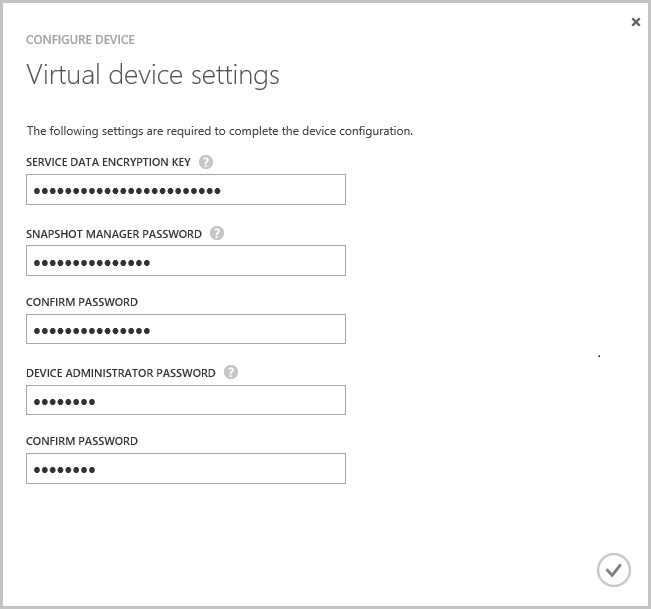

<!---author: alkohli, last updated: 11/05/2015 --->

#### To configure and register the virtual device

1. Select the StorSimple virtual device you just created in the **Devices** page. 

2. Click **complete device setup**. This starts the Configure device wizard.

    

3. Enter the **Service Data Encryption Key** in the space provided.

4. Enter the Snapshot Manager and Device Administrator passwords of the length and settings specified.

5. Click the check mark to finish the initial configuration and registration of the virtual device. 

    

After the configuration and registration is complete, the device will come online. (It may take several minutes for the device to come online.)

