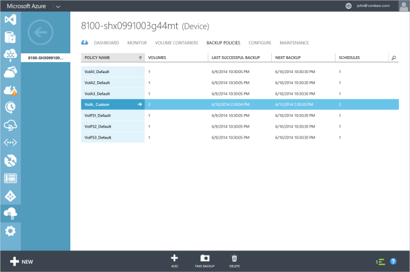

<!--author=SharS last changed: 9/15/15-->

#### To create a custom backup policy

1. On the **Devices** page, click **Backup Policies** and then click **Add**.

2. In the **Add a backup policy** dialog box, under **Define your backup policy**:

    1. Specify a backup policy name.

    2. Select the volumes to be added to this policy. You can choose to add multiple volumes by selecting them from the drop-down list.

    3. Click the check icon .

     You will be notified after the policy is created successfully. The backup policies page will also be updated to show the newly created policy.

4. Click the policy name (first column) to drill down into details of the policy you just created.

5. Click **manage schedules**.

6. In the **Manage Schedules** dialog box:

    1. Select **Create new** to add another schedule.

    2. From the drop-down list, choose the backup type as **local** or **cloud** snapshot.

    3. Specify the backup frequency in minutes, hours, days, or weeks.

    4. Select a retention. The retention choices depend on the backup frequency.
 
    5. Select the starting time and date for the policy.

    6. Select the check box to enable the policy.

7. Click the check icon  to finish.

8. You will return to the policy details. Click **Save** to save the changes you made to this policy. You will be notified when the policy has been saved.

9. Navigate back to the **Backup Policies** page. The tabular listing of the backup policies will be updated to display the modified policy.

    .

