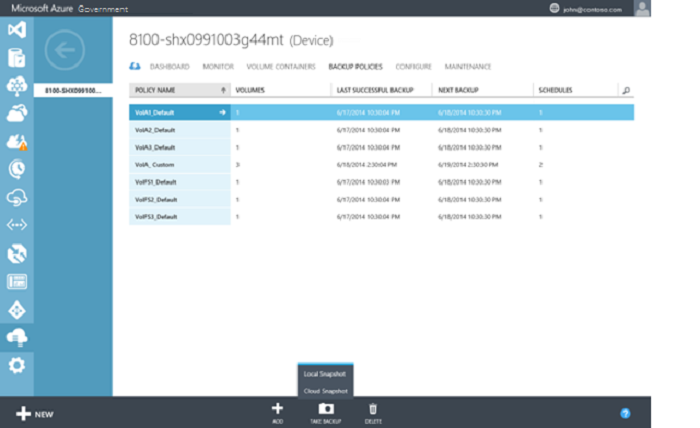
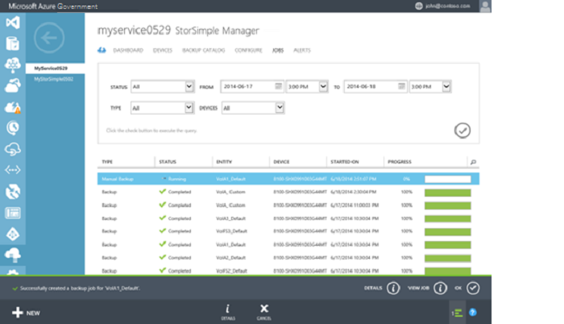

<properties 
   pageTitle="Create a manual backup"
   description="Explains how to start a manual, on-demand backup job."
   services="storsimple"
   documentationCenter="NA"
   authors="SharS"
   manager="carolz"
   edito**r="" />
<tags 
   ms.service="storsimple"
   ms.devlang="NA"
   ms.topic="article"
   ms.tgt_pltfrm="NA"
   ms.workload="TBD"
   ms.date="08/14/2015"
   ms.author="v-sharos" />

#### To create a manual backup

1. On the **Devices** page, go to the **Backup Policies** tab. This tab lists all the backup policies in a tabular format, including the policy for the volume that you want to back up.

2. Select the policy by clicking anywhere in the corresponding row except for the first column. At the bottom of the page, click **Take backup**. The button will expand to show the backup options: local snapshot and cloud snapshot. 

3. When you choose either of these options, you will be prompted for confirmation. Click **Yes**. 

    
 
    This will start a job to create a snapshot. You will see a notification at the bottom of the page after the job is successfully created.

4. To monitor the job, click **View Job** in the notification area (at the bottom of the page). 

    

5. After the backup job is finished, go to the **Backup catalog** tab.

6. Set the filter selections to the appropriate device, backup policy, and time range. Click the check icon  after setting the filters.

  The backup should appear in the list of backup sets that is displayed in the catalog.
