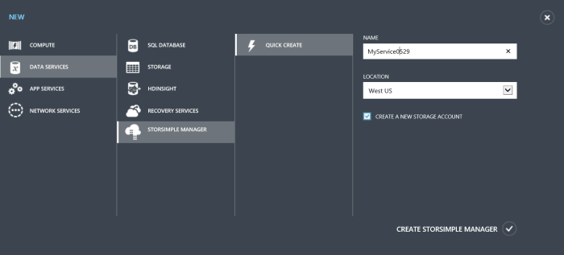
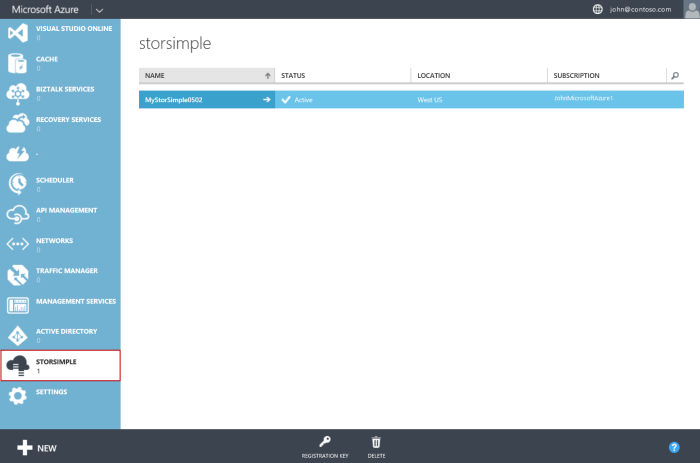

<properties 
   pageTitle="Create a new StorSimple Manager service"
   description="Describes how to create a new instance of the StorSimple Manager service."
   services="storsimple"
   documentationCenter="NA"
   authors="SharS"
   manager="carolz"
   editor="" />
<tags 
   ms.service="storsimple"
   ms.devlang="NA"
   ms.topic="article"
   ms.tgt_pltfrm="NA"
   ms.workload="TBD"
   ms.date="08/18/2015"
   ms.author="v-sharos" />

#### To create a new service

1. Using your Microsoft account credentials, log on to the Management Portal at this URL: [http://azure.microsoft.com/](http://azure.microsoft.com/).

2. In the Management Portal, click **New** > **Data Services** > **StorSimple Manager** > **Quick Create**.

3. In the form that is displayed, do the following:
  1. Supply a unique **Name** for your service. This is a friendly name that can be used to identify the service. The name can have between 2 and 50 characters that can be letters, numbers, and hyphens. The name must start and end with a letter or a number.
  2. Supply a **Location** for your service. In general, choose a Location closest to the geographical region where you want to deploy your device. You may also want to factor in the following: 
	 
		- If you have existing workloads in Azure that you also intend to deploy with your StorSimple device, you should use that datacenter.
		- Your StorSimple Manager service and Azure storage can be in two separate locations. In such a case, you are required to create the StorSimple Manager and Azure storage account separately. To create an Azure storage account, go to the Azure Storage service in the Management Portal and follow the steps in [Create an Azure Storage account](storage-create-storage-account.md#create-a-storage-account). After you create this account, add it to the StorSimple Manager service by following the steps in [Configure a new storage account for the service](storsimple-deployment-walkthrough.md#configure-a-new-storage-account-for-the-service).
		 
  3. Choose a **Subscription** from the drop-down list. The subscription is linked to your billing account. This field is not present if you have only one subscription.
  4. Select **Create a new storage account** to automatically create a storage account with the service. This storage account will have a special name such as "storsimplebwv8c6dcnf." If you need your data in a different location, uncheck this box. 
  5. Click **Create StorSimple Manager** to create the service.

   

  You will be directed to the **Service** landing page. The service creation will take a few minutes. After the service is successfully created, you will be notified appropriately and the status of the service will change to **Active**.
 
   
