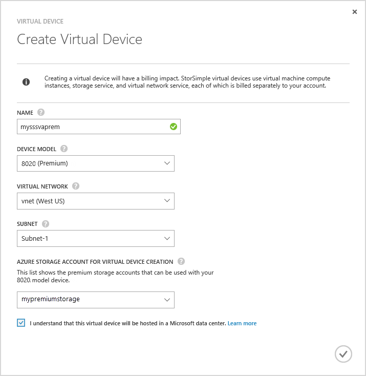

#### To create a virtual device

1.  In the Azure portal, go to the **StorSimple Manager** service.

2. Go to the **Devices** page. Click **Create virtual device** at the bottom of the **Devices** page.

3. In the **Create Virtual Device dialog box**, specify the following details.

     

	1. **Name** – A unique name for your virtual device.

	2. **Model** - Choose the model of the virtual device. This field is presented only if you are running Update 2 or later. An 8010 device model offers 30 TB of Standard Storage whereas 8020 has 64 TB of Premium Storage. Specify 8010
	3.  to deploy item level retrieval  scenarios from backups. Select 8020 to deploy high performance, low latency workloads or used as a secondary device for disaster recovery.
	 
	4. **Version** - Choose the version of the virtual device. If an 8020 device model is selected, then the version field will not be presented to the user. This option is absent if all the physical devices registered with this service are running Update 1 (or later). This field is presented only if you have a mix of pre-Update 1 and Update 1 physical devices registered with the same service. Given the version of the virtual device will determine which physical device you can failover or clone from, it is important that you create an appropriate version of the virtual device. Select:

	   - Version Update 0.3 if you will fail over or DR from a physical device running Update 0.3 or earlier. 
	   - Version Update 1 if you will fail over or clone from a physical device running Update 1 (or later). 
	   
	
	5. **Virtual Network** – Specify a virtual network that you want to use with this virtual device. If using Premium Storage (Update 2 or later), you must select a virtual network that is supported with the Premium Storage account. The unsupported virtual networks will be grayed out in the dropdown list. You will be warned if you select an unsupported virtual network. 

	5. **Storage Account for Virtual Device Creation** – Select a storage account to hold the image of the virtual device during provisioning. This storage account should be in the same region as the virtual device and virtual network. It should not be used for data storage by either the physical or the virtual device. By default, a new storage account will be created for this purpose. However, if you know that you already have a storage account that is suitable for this use, you can select it from the list. If creating a premium virtual device, the dropdown list will only display Premium Storage accounts. 

    	>[AZURE.NOTE] The virtual device can only work with the Azure storage accounts. Other cloud service providers such as Amazon, HP, and OpenStack (that are supported for the physical device) are not supported for the StorSimple virtual device.
	
	1. Click the check mark to indicate that you understand that the data stored on the virtual device will be hosted in a Microsoft datacenter. When you use only a physical device, your encryption key is kept with your device; therefore, Microsoft cannot decrypt it. 
	 
		When you use a virtual device, both the encryption key and the decryption key are stored in Microsoft Azure. For more information, see [security considerations for using a virtual device](storsimple-security/#storsimple-virtual-device-security).
	2. Click the check icon to create the virtual device. The device may take around 30 minutes to be provisioned.

	

    
