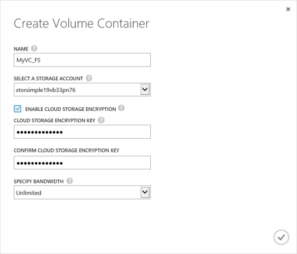

<properties 
   pageTitle="Create a volume container"
   description="Describes how to create a volume container on a StorSimple device."
   services="storsimple"
   documentationCenter="NA"
   authors="SharS"
   manager="adinah"
   editor="tysonn" />
<tags 
   ms.service="storsimple"
   ms.devlang="NA"
   ms.topic="article"
   ms.tgt_pltfrm="NA"
   ms.workload="TBD"
   ms.date="04/01/2015"
   ms.author="v-sharos" />

#### To create a volume container

1. In the device **Quick Start** page, click **Add a volume container**. The **Create Volume Container** dialog box appears.

    

2. In the **Create Volume container** dialog box:
  1. Supply a **Name** for your volume container. The name must be 3 to 32 characters long.
  2. Select a **Storage Account** to associate with this volume container. You can choose the default account that is generated at the time of service creation. You can also use the **Add new** option to specify a storage account that is not linked to this service subscription.
  3. Select **Enable Cloud Storage Encryption** to enable encryption of the data sent from the device to the cloud.
  4. Provide and confirm a **Cloud Storage Encryption Key** that is 8 to 32 characters long. This key is used by the device to access encrypted data.
  5. Select **Unlimited** in the **Specify bandwidth** drop-down list if you wish to consume all the available bandwidth. You can also set this option to **Custom** to employ bandwidth controls, and specify a value between 1 and 1,000 Mbps. 
  If you have your bandwidth usage information available, you may be able to allocate bandwidth based on a schedule by specifying **Select a bandwidth template**. For a step-by-step procedure, go to [Add a bandwidth template](https://msdn.microsoft.com/library/dn757746.aspx#addBT).
  6. Click the check icon  to save this volume container and exit the wizard. 

  The newly created volume container will be listed on the **Volume containers** page.
