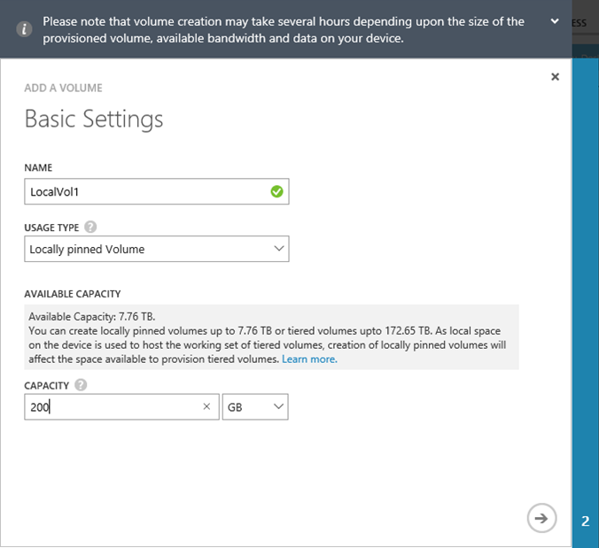
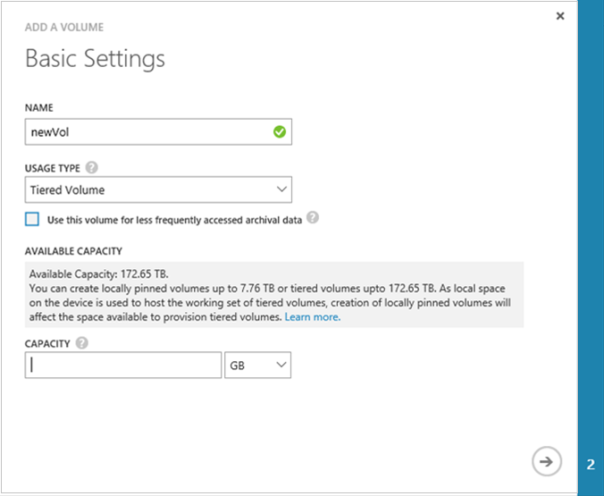
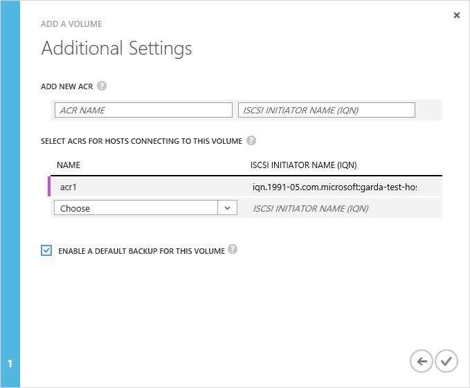

<!--author=SharS last changed: 02/29/2016-->

#### To create a volume

1. On the device **Quick Start** page, click **Add a volume**. This starts the Add a volume wizard.

2. In the Add a volume wizard, under **Basic Settings**:

	4. Type a **Name** for your volume.
	5. On the drop-down list, select the **Usage Type** for your volume. For workloads that require local guarantees, low latencies, and higher performance, select a **Locally pinned** volume. For all other data, select a **Tiered** volume. If you are using this volume for archival data, check **Use this volume for less frequently accessed archival data**. 
	
		A locally pinned volume is thickly provisioned and ensures that the primary data on the volume stays local to the device and does not spill to the cloud.  If you create a locally pinned volume, the device will check for available space on the local tiers to provision the volume of the requested size. The operation of creating a locally pinned volume may involve spilling existing data from the device to the cloud and the time taken to create the volume may be long. The total time depends on the size of the provisioned volume, available network bandwidth, and the data on your device. 

		A tiered volume is thinly provisioned and can be created very quickly. If you are using the tiered volume for archival data, selecting **Use this volume for less frequently accessed archival data** changes the deduplication chunk size for your volume to 512 KB. If this field is not checked, the corresponding tiered volume will use a chunk size of 64 KB. A larger deduplication chunk size allows the device to expedite the transfer of large archival data to the cloud.

	3. Specify the **Provisioned Capacity** for your volume. Make a note of the capacity that is available based on the volume type selected. The specified volume size must not exceed the available space.

		You can provision locally pinned volumes up to 8 TB or tiered volumes up to 200 TB on the 8100 device. On the larger 8600 device, you can provision locally pinned volumes up to 20 TB or tiered volumes up to 500 TB. As local space on the device is required to host the working set of tiered volumes, creation of locally pinned volumes will impact the space available for provisioning tiered volumes. Therefore, if you create a locally pinned volume, space available for creation of tiered volumes will be reduced. Similarly, if a tiered volume is created, the available space for creation of  locally pinned volumes will be reduced. 

		If you provision a locally pinned volume of 8 TB (maximum allowable size) on your 8100 device, then you will have exhausted all the local space available on the device. You will not be able to create any tiered volume from that point onwards as there is no local space on the device to host the working set of the tiered volume. Existing tiered volumes also affect the space available. For example, if you have an 8100 device that already has tiered volumes of 100 TB, only 4 TB of space will be available for locally pinned volumes.

        The following image shows the **Basic Settings** dialog box for a locally pinned volume.

         

        The following image shows the **Basic Settings** dialog box for a tiered volume.

         

   4. Click the arrow icon  to go to the next page.

3. In the **Additional Settings** dialog box, add a new access control record (ACR):

	1. Supply a **Name** for your ACR.
	2. Under **iSCSI Initiator Name**, provide the iSCSI Qualified Name (IQN) of your Windows host. If you don't have the IQN, go to [Get the IQN of a Windows Server host](#get-the-iqn-of-a-windows-server-host).
	3. Under **Default backup for this volume?**, select the **Enable** check box. The default backup will create a policy that executes at 22:30 each day (device time) and creates a cloud snapshot of this volume.
	 
     > [AZURE.NOTE] After the backup is enabled here, it cannot be reverted. You will need to edit the volume to modify this setting.

     

4. Click the check icon . A volume will be created with the specified settings.

