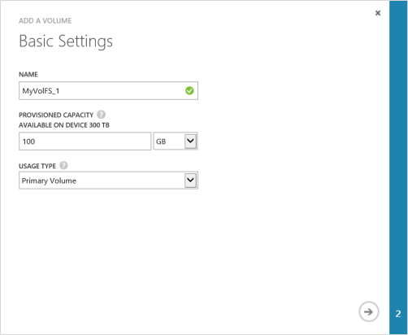

<properties 
   pageTitle="Create a volume"
   description="Explains how to add a volume on a StorSimple device."
   services="storsimple"
   documentationCenter="NA"
   authors="SharS"
   manager="adinah"
   editor="tysonn" />
<tags 
   ms.service="storsimple"
   ms.devlang="NA"
   ms.topic="article"
   ms.tgt_pltfrm="NA"
   ms.workload="TBD"
   ms.date="04/28/15"
   ms.author="v-sharos" />

#### To create a volume

1. On the device **Quick Start** page, click **Add a volume**. This starts the Add a volume wizard.

2. In the Add a volume wizard, under **Basic Settings**:
   1. Type a **Name** for your volume.
   2. Specify the **Provisioned Capacity** for your volume. **The volume capacity must be between 1 GB and 64 TB.**
   3. On the drop-down list, select the **Usage Type** for your volume. For less frequently accessed archival data, select an **Archive volume**. For all other types of data, select **Primary volume**.
   4. Click the arrow icon  to go to the next page.

     

3. In the **Additional Settings** dialog box, add a new access control record (ACR):
   1. Supply a **Name** for your ACR.
   2. Under **iSCSI Initiator Name**, provide the iSCSI Qualified Name (IQN) of your Windows host. If you don't have the IQN, go to [Get the IQN of a Windows Server host](#get-the-iqn-of-a-windows-server-host).
   3. Under **Default backup for this volume?**, select the **Enable** check box. The default backup will create a policy that executes at 22:30 each day (device time) and creates a cloud snapshot of this volume.

     > [AZURE.NOTE] After the backup is enabled here, it cannot be reverted. You will need to edit the volume to modify this setting.

     

4. Click the check icon . A volume will be created with the specified settings.

