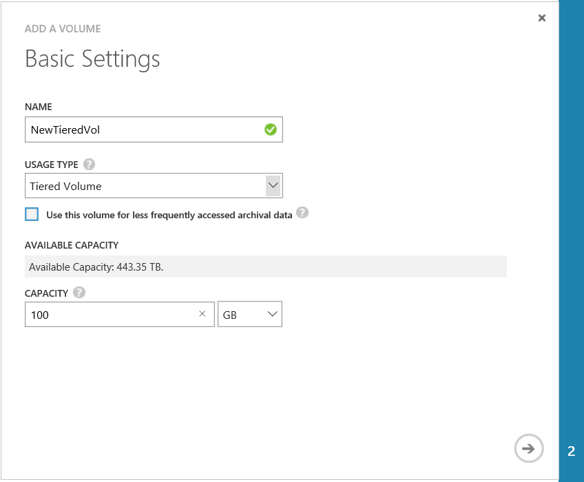
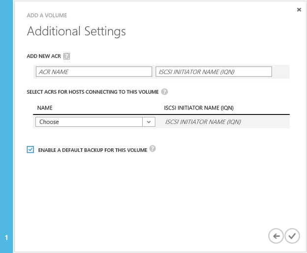

<!--author=SharS last changed: 02/04/2016-->

#### To create a volume

1. On the device **Quick Start** page, click **Add a volume**. This starts the Add a volume wizard.

2. In the Add a volume wizard, under **Basic Settings**, do the following:
   1. Supply a **Name** for your volume.
   2. Specify the **Provisioned Capacity** for your volume in GB or TB. The volume capacity must be between 1 GB and 64 TB for a physical device.
   3. On the drop-down list, select the **Usage Type** for your volume. 
   4. If you are using this volume for archival data, select the **Use this volume for less frequently accessed archival data** check box. For all other use cases, simply select **Tiered Volume**. (Tiered volumes were formerly called primary volumes).

        

    4. Click the arrow icon  to go to the next page.

3. In the **Additional Settings** dialog box, add a new access control record (ACR):
   1. Supply a **Name** for your ACR.
   2. Under **iSCSI Initiator Name**, provide the iSCSI Qualified Name (IQN) of your Windows host. If you don't have the IQN, go to [Get the IQN of a Windows Server host](#get-the-iqn-of-a-windows-server-host).
   3. We recommend that you enable a default backup by selecting the **Enable a default backup for this volume** check box. The default backup will create a policy that executes at 22:30 each day (device time) and creates a cloud snapshot of this volume.

        > [AZURE.NOTE] After the backup is enabled here, it cannot be reverted. You will need to edit the volume to modify this setting.

        

4. Click the check icon . A volume will be created with the specified settings.

 **Video available**

To watch a video that demonstrates how to create a StorSimple volume, click [here](https://azure.microsoft.com/documentation/videos/create-a-storsimple-volume/).

