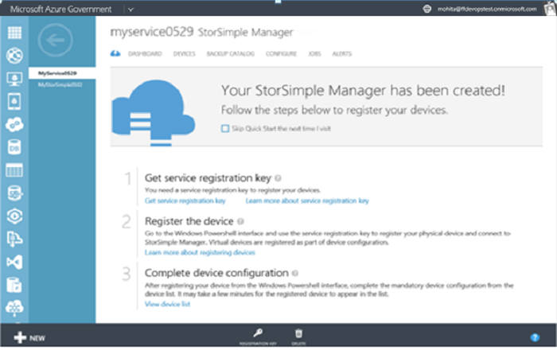
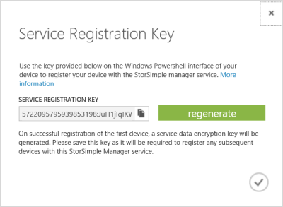

<!--author=SharS last changed: 9/17/15-->

#### To get the StorSimple service registration key

1. On the **StorSimple Manager service** page, click the service that you created. This will take you to the **Quick Start** page. (You can click the quick start icon  to access the **Quick Start** page at any time.)

     

2. Click **Get service registration key**. You can also click **Registration Key** at the bottom of the page. You will have to wait for a few minutes while the key is retrieved. The **Service Registration Key** dialog box appears.

     

3. Locate the service registration key.

4. Click the copy icon  to copy the key and save it for later use.

5. Click the check icon  to close this dialog box and return to the **Quick Start** page.

> [AZURE.NOTE] The service registration key is used to register all the devices that need to register with your StorSimple Manager service.

 