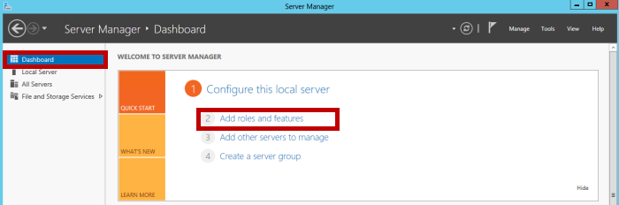
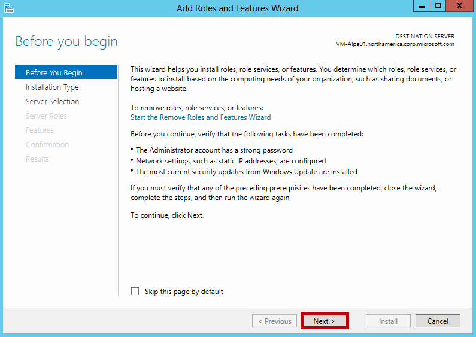
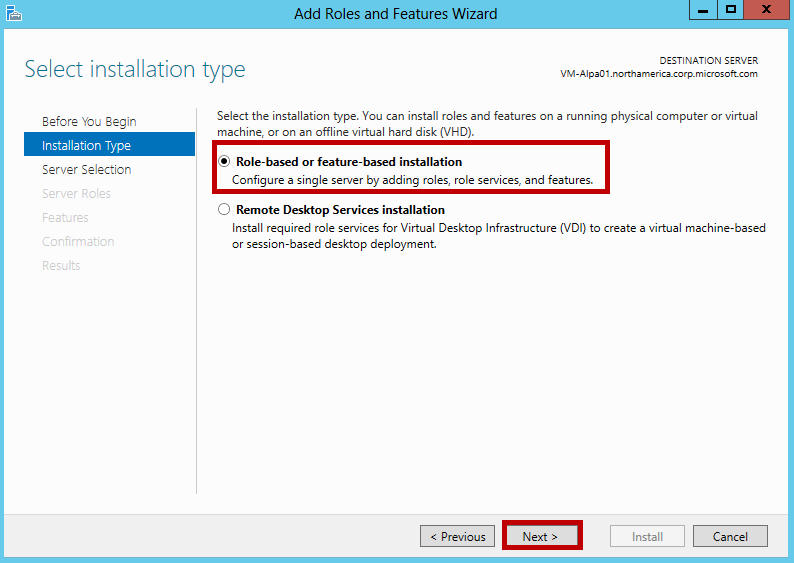
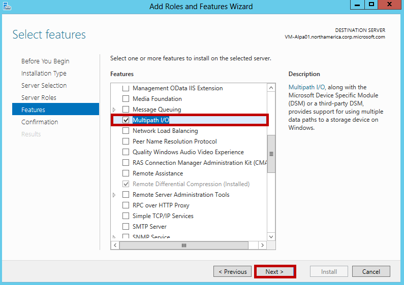
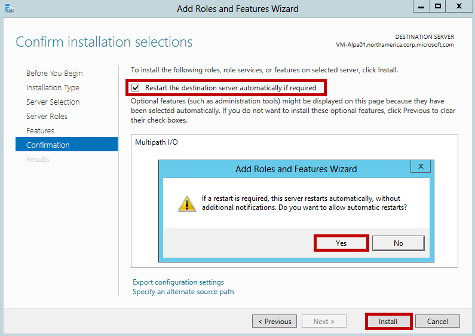
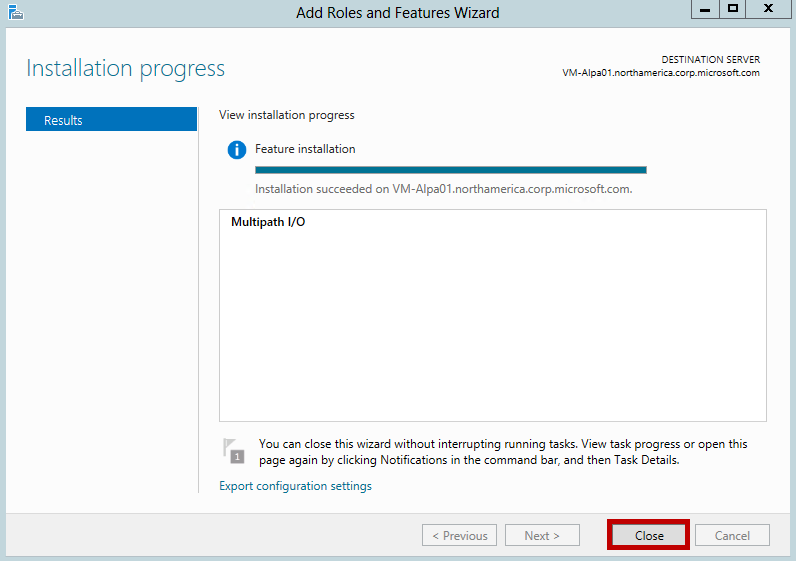

#### To install MPIO on the host

1. Open Server Manager on your Windows Server host. By default, Server Manager starts when a member of the Administrators group logs on to a computer that is running Windows Server 2012 R2 or Windows Server 2012. If the Server Manager is not already open, click **Start > Server Manager**.

	

2. Click **Server Manager > Dashboard > Add roles and features**. This starts the **Add Roles and Features** wizard.

	

3. In the **Add Roles and Features** wizard, do the following:

	- On the **Before you begin** page, click **Next**.
	- On the **Select installation type** page, accept the default setting of **Role-based or feature-based** installation. Click **Next**.
	
		
	- On the **Select destination server** page, choose **Select a server from the server pool**. Your host server should be discovered automatically. Click **Next**.
	- On the **Select server roles** page, click **Next**.
	- On the **Select features** page, select **Multipath I/O**, and click **Next**.
	
		
	- On the **Confirm installation selections** page, confirm the selection and then select **Restart the destination server automatically if required**, as shown below. Click **Install**.
	
		
	- You will be notified when the installation is complete. Click **Close** to close the wizard.
	
		