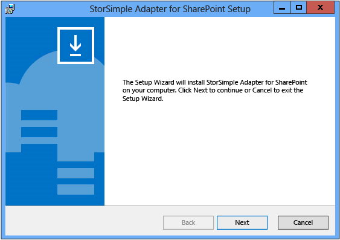
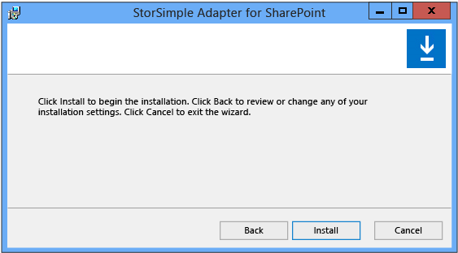
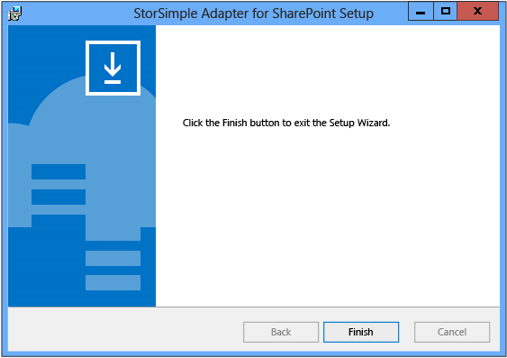

#### To install the StorSimple Adapter for SharePoint
1. Copy the installer to the web front end (WFE) server that is also configured to run the SharePoint Central Administration web application. 
2. Use an account with administrator privileges to sign in to the WFE server.
3. Double-click the installer. The StorSimple Adapter for SharePoint Setup Wizard starts. Click **Next** to begin the installation.
   
    
4. In the StorSimple Adapter for SharePoint setup configuration page, select an installation location, type the IP address for the DATA 0 network interface on your StorSimple device, and then click **Next**. 
   
     
5. In the setup confirmation page, click **Install**.
   
     
6. Click **Finish** to close the Setup Wizard.
   
     
7. Open the SharePoint Central Administration page. You should see a StorSimple Configuration group that contains the StorSimple Adapter for SharePoint links.
8. Go to the next step: [Configure RBS](#configure-rbs).

