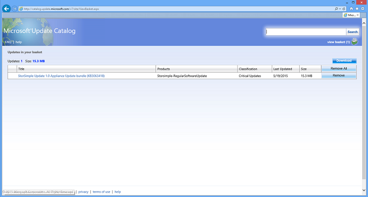

<properties 
   pageTitle="Option 1: Use Windows PowerShell for StorSimple to install Update 1"
   description="Explains how to use Windows PowerShell for StorSimple to install StorSimple 8000 Series Update 1."
   services="storsimple"
   documentationCenter="NA"
   authors="SharS"
   manager="adinah"
   editor="tysonn" />
<tags 
   ms.service="storsimple"
   ms.devlang="NA"
   ms.topic="article"
   ms.tgt_pltfrm="NA"
   ms.workload="TBD"
   ms.date="05/22/2015"
   ms.author="v-sharos" />

#### To install Update 1 from Windows PowerShell for StorSimple

1. Perform the following steps to download the software update.

    1. Start Internet Explorer and navigate to [http://catalog.update.microsoft.com/v7/site/Home.aspx](http://catalog.update.microsoft.com/v7/site/Home.aspx).
    2. If you are a first-time user, you will be prompted to install a Microsoft Update Catalog. Click **Install**.
    
        

    3. You will see a catalog search screen. Enter **3063418** in the search box, and click **Search**.

        

    4. You will see the **StorSimple Update 1.0 Appliance Update** bundle. Click **Add**. The update will be added to the basket. 

         

    5. Click **View Basket**.
 
         

    6. Click **Download**. Specify or Browse to a local location where you want the download to appear. The update (all-hcsmdssoftwareupdate_288da2cc8cd2e3c3958b603a79346cb586fb8fe3.exe) will be downloaded in a StorSimple Update 1.0 Appliance Update bundle (KB3063418)” folder to the chosen location. The folder can also be copied to a network share that is reachable from the device.
        
2. To install the software update, access the Windows PowerShell interface on your StorSimple device serial console. Follow the detailed instructions in [Use PuTTy to connect to the serial console](#use-putty-to-connect-to-the-serial-console).

3. At the command prompt, press Enter.

4. Select **Option 1** to log on to the device with full access.

5. To install the update package, at the command prompt, type:

    `Start-HcsHotfix -Path <path to update file> -Credential <credentials in domain\username format>`

    The credential parameter is used only if you are accessing an authenticated share.

    Sample output is shown below.

        ````
        Controller0>Start-HcsHotfix -Path \\10.100.100.100\share
        \hcsmdssoftwareupdate.exe -Credential contoso\John
      
        Confirm

        This operation starts the hotfix installation and could reboot one or
        both of the controllers. If the device is serving I/Os, these will not 
        be disrupted. Are you sure you want to continue?
        [Y] Yes [N] No [?] Help (default is "Y"): Y

        ````
 
6. Type **Y** when prompted to confirm the hotfix installation.

7. Monitor the update by using the Get-HcsUpdateStatus cmdlet.

    The following sample output shows the update in progress.

        ````
        Controller0>Get-HcsUpdateStatus
        RunInprogress       : True
        LastHotfixTimestamp : 4/13/2015 10:56:13 PM
        LastUpdateTimestamp : 4/13/2015 10:35:25 PM
        Controller0Events   :
        Controller1Events   : 
        ````
 
     The following sample output indicates that the update is finished.

        ````
        Controller1>Get-HcsUpdateStatus

        RunInprogress       : False
        LastHotfixTimestamp : 4/13/2015 10:56:13 PM
        LastUpdateTimestamp : 4/13/2015 10:35:25 PM
        Controller0Events   :
        Controller1Events   :

        ````
 
8. After the software update is complete, navigate to the Maintenance page in the Management Portal. Scan for available updates. You should see that more software updates are available.

9. Click **Install updates** to apply all the available software updates from the portal. 

10. After the software updates are complete, verify the system software, driver, and firmware versions. Type the following command:

    `Get-HcsSystem`

    You should see the following versions:

    - HcsSoftwareVersion: 6.3.9600.17491
    - CisAgentVersion: 1.0.9037.0
    - MdsAgentVersion: 26.0.4696.1433 
 
11. To verify that the firmware was updated correctly, type:

    `Start-HcsFirmwareCheck`

    The firmware status should be **UpToDate**.
