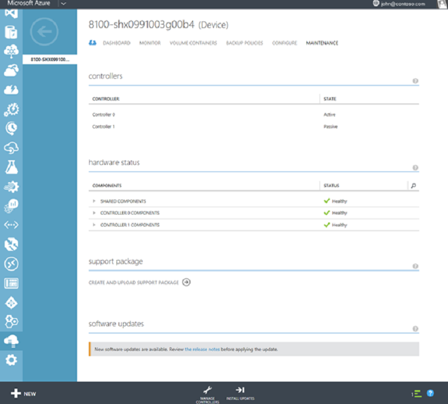
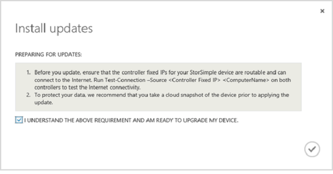
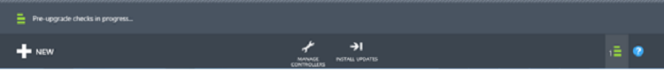
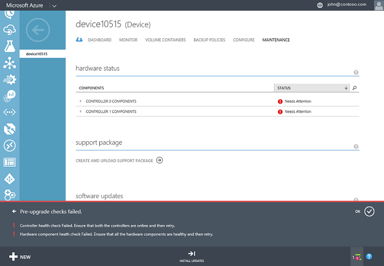
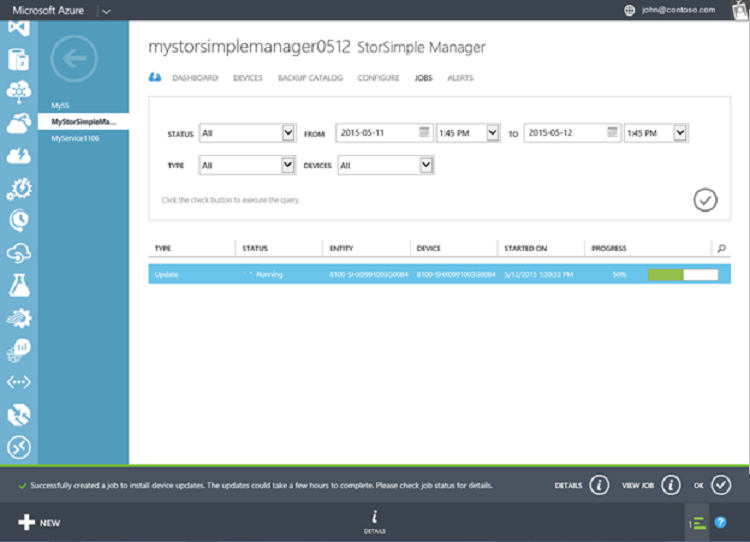

<properties 
   pageTitle="Install Update 1 from the Azure Management Portal"
   description="Explains how to use the Management Portal to install StorSimple 8000 Series Update 1."
   services="storsimple"
   documentationCenter="NA"
   authors="SharS"
   manager="adinah"
   editor="" />
<tags 
   ms.service="storsimple"
   ms.devlang="NA"
   ms.topic="article"
   ms.tgt_pltfrm="NA"
   ms.workload="TBD"
   ms.date="08/12/2015"
   ms.author="v-sharos" />

#### To install Update 1 from the Management Portal

1. On the StorSimple service page, select your device. Navigate to **Devices** > **Maintenance**.

2. At the bottom of the page, click **Scan Updates**. A job will be created to scan for available updates. You will be notified when the job has completed successfully.

3. In the **Software Updates** section on the same page, you will see that new software updates are available. We recommend that you review the release notes before you apply Update 1.0 on your device.

    

4. At the bottom of the page, click **Install Updates**.

5. You will be prompted for confirmation. Click **OK**.

6. An **Install Updates** dialog box will be presented. Make sure that your device satisfies the checks listed in this dialog box. Select **I understand the above requirement and am ready to update my device**. Click the check icon.

    

7. You will be notified that pre-update checks are in progress.
  
    

    The following is an example in which the pre-upgrade check failed. You will need to verify that both the device controllers are healthy and online. You will also need to check the health of the hardware components. In this example, Controller 0 and Controller 1 components need attention. You may need to contact Microsoft Support if you cannot address these issues by yourself.

    

8. After the pre-upgrade checks are successfully completed, an update job will be created. You will be notified when the update job is successfully created.
 
    

    The update will then be applied on your device.
 
9. To monitor the progress of the update job, click **View Job**. On the Jobs page, you can see the update progress. 

    

10. The update will take a few hours to complete. You can view the details of the job at any time.

    

11. After the job is complete, navigate to the **Maintenance** page and scroll down to **Software Updates**.

12. Verify that your device is running **StorSimple 8000 Series Update 1.0 (6.3.9600.17491)**. The **Last updated date** should also be modified.

    

