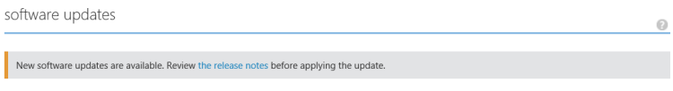
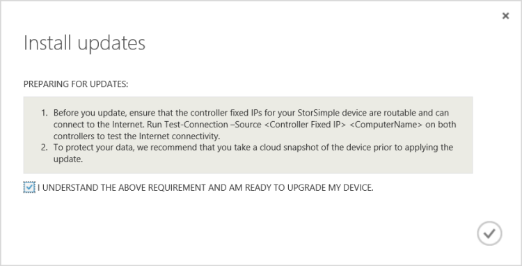
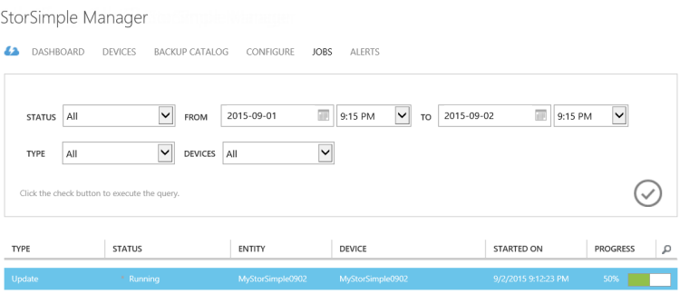

<!--author=SharS last changed: 01/15/2016-->

#### To install Update 1.2 from the Azure classic portal

1. On the StorSimple service page, select your device. Navigate to **Devices** > **Maintenance**.

2. At the bottom of the page, click **Scan Updates**. A job will be created to scan for available updates. You will be notified when the job has completed successfully.

3. In the **Software Updates** section on the same page, you will see that new software updates are available. We recommend that you review the release notes before you apply Update 1.2 on your device.

    

4. At the bottom of the page, click **Install Updates**.

5. You will be prompted for confirmation. Click **OK**.

6. An **Install Updates** dialog box will be presented. Your device should satisfy the checks listed in this dialog box. These steps were completed prior to the update. Select **I understand the above requirement and am ready to update my device**. Click the check icon.

    

7. A set of automatic pre-checks will now start. These include:

	- **Controller health checks** to verify that both the device controllers are healthy and online.
	
	- **Hardware component health checks** to verify that all the hardware components on your StorSimple device are healthy.
	
	- **DATA 0 checks** to verify that DATA 0 is enabled on your device. If this interface is not enabled, you will need to enable it and then retry.
	
	- **DATA 2 and DATA 3 checks** to verify that DATA 2 and DATA 3 network interfaces are not enabled. If these interfaces are enabled, then you will need to disable them and then try to update your device. This check is performed only if you are updating from a device running GA software. Devices running versions 0.1, 0.2, or 0.3 will not need this check.
	
	- **Gateway check** on any device running a version prior to Update 1. This check is performed on all the device running pre-update 1 software but fails on the devices that have a gateway configured for a network interface other than DATA 0.
 
	Update 1.2 will only be applied if all the above pre-update checks are successfully completed. You will be notified that pre-update checks are in progress.
  
    

    The following is an example in which the pre-upgrade check failed. You will need to verify that both the device controllers are healthy and online. You will also need to check the health of the hardware components. In this example, Controller 0 and Controller 1 components need attention. You may need to contact Microsoft Support if you cannot address these issues by yourself.

   	 

	> [AZURE.NOTE] After you have applied Update 1.2 on your StorSimple device, DATA 2 and DATA 3 checks and the gateway check will no longer be necessary for the future updates. The other pre-checks will still be required.

8. After the pre-upgrade checks are successfully completed, an update job will be created. You will be notified when the update job is successfully created.
 
    

    The update will then be applied on your device.
 
9. To monitor the progress of the update job, click **View Job**. On the **Jobs** page, you can see the update progress. 

    

10. The update will take a few hours to complete. You can view the details of the job at any time.

    

11. After the job is complete, navigate to the **Maintenance** page and scroll down to **Software Updates**.

12. Verify that your device is running **StorSimple 8000 Series Update 1.2 (6.3.9600.17584)**. The **Last updated date** should also be modified.

    

13. You will now see that Maintenance mode updates are available. These updates are disruptive updates that result in device downtime and can only be applied via the Windows PowerShell interface of your device. Follow the instructions in [Install maintenance mode updates](storsimple-update-device.md#install-maintenance-mode-updates-via-windows-powershell-for-storsimple) to install these updates via the Windows PowerShell for StorSimple.

> [AZURE.NOTE] In certain instances, the message indicating maintenance mode updates are available may be displayed up to 24 hours after the maintenance mode updates are successfully applied on the device.  

