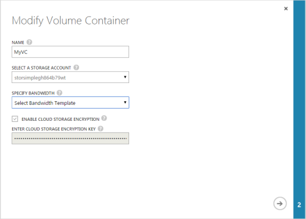
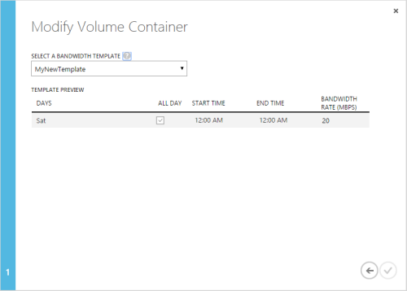

<properties 
   pageTitle="Modify a volume container"
   description="Explains how you can use the StorSimple Manager service volume containers page to modify a volume container."
   services="storsimple"
   documentationCenter="NA"
   authors="SharS"
   manager="carolz"
   editor="" />
<tags 
   ms.service="storsimple"
   ms.devlang="NA"
   ms.topic="article"
   ms.tgt_pltfrm="NA"
   ms.workload="TBD"
   ms.date="08/14/2015"
   ms.author="v-sharos" />

#### To modify a volume container

1. On the **Devices** page, select the device, double-click it, and then click the **Volume containers** tab.

2. In the tabular listing of the volume containers, select the setting that you want to modify, and click **Modify**.

3. In the **Modify Volume container** dialog box, do the following:

    1. Change the name of the volume container, modify the associated bandwidth, and specify whether or not the data residing in the cloud needs to be encrypted.

        

    2. The encryption key and storage account cannot be changed after they are specified. If you specified **Select a bandwidth template**, click the arrow to proceed to the next page.

4. In the next page of the **Modify Volume Container** dialog box:

    1. From the drop-down list, choose an existing bandwidth template.

    2. Review the schedule settings for the specified bandwidth template.

        

    3. Click the check icon  to save the updated settings. The **Volume containers** page will be updated to reflect the changes.

 

