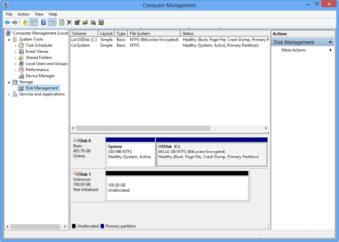

#### To mount, initialize, and format a volume
1. Start the Microsoft iSCSI initiator.
2. In the **iSCSI Initiator Properties** window, on the **Discovery** tab, click **Discover Portal**.
3. In the **Discover Target Portal** dialog box, supply the IP address of your iSCSI-enabled network interface, and then click **OK**. 
4. In the **iSCSI Initiator Properties** window, on the **Targets** tab, locate the **Discovered targets**. The device status should appear as **Inactive**.
5. Select the target device and then click **Connect**. After the device is connected, the status should change to **Connected**. (For more information about using the Microsoft iSCSI initiator, see [Installing and Configuring Microsoft iSCSI Initiator][1]).
6. On your Windows host, press the Windows Logo key + X, and then click **Run**. 
7. In the **Run** dialog box, type **Diskmgmt.msc**. Click **OK**, and the **Disk Management** dialog box will appear. The right pane will show the volumes on your host.
8. In the **Disk Management** window, the mounted volumes will appear as shown in the following illustration. Right-click the discovered volume (click the disk name), and then click **Online**.
   
      
9. Right-click the volume (click the disk name) again, and then click **Initialize**.
10. To format a simple volume, perform the following steps:
    
    1. Select the volume, right-click it (click the right area), and click **New Simple Volume**.
    2. In the New Simple Volume wizard, specify the volume size and drive letter and configure the volume as an NTFS file system.
    3. Specify a 64 KB allocation unit size. This allocation unit size works well with the deduplication algorithms used in the StorSimple solution.
    4. Perform a quick format.

 **Video available**

To watch a video that demonstrates how to mount, initialize, and format a StorSimple volume, click [here](https://azure.microsoft.com/documentation/videos/mount-initialize-and-format-a-storsimple-volume/).

<!--Link references-->
[1]: /previous-versions/windows/it-pro/windows-server-2008-R2-and-2008/ee338480(v=ws.10)