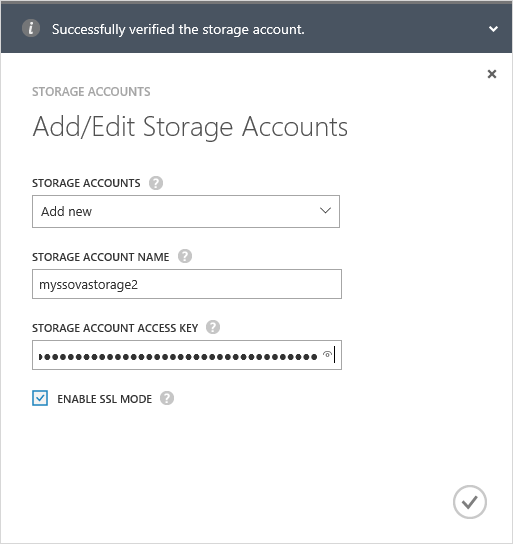

<!--author=alkohli last changed: 01/28/16-->

#### To add a new storage account 

1. On the StorSimple Manager service landing page, select your service and double-click it. This will take you to the **Quick Start** page. Select the **Configure** page.

2. Click **Add/edit storage account**.

3. In the **Add/Edit Storage Account** dialog box, do the following:

  1. Click **Add new**.
  2. Provide the name of your Azure storage account.
  3. Supply the primary **Access Key** for your Azure storage account. To get this key, go to the Storage service, select your storage account and click **Manage account keys**. You can now copy the **primary access key**.
  4. Select **Enable SSL Mode** to create a secure channel for network communication between your StorSimple device and the cloud. Clear the **Enable SSL Mode** check box only if you are operating within a private cloud.
  5. Click the check icon . You will be notified after the storage account is successfully created.

		

4. The newly created storage account will be displayed on the **Configure** page under **Storage accounts**. 
