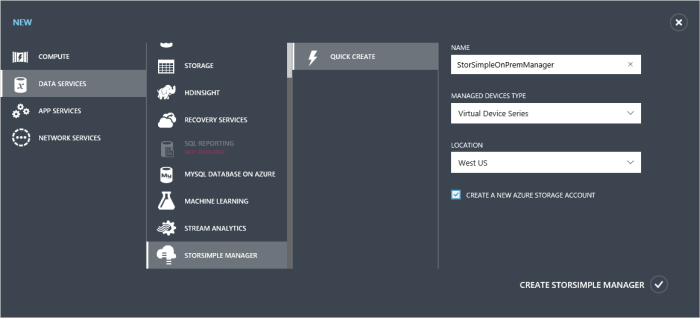
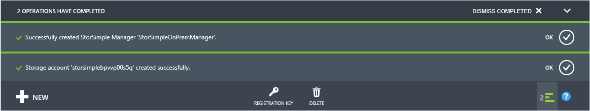

#### To create a new service

1.  Using your Microsoft account credentials, log on to the Azure classic portal at this URL: [https://manage.windowsazure.com/](https://manage.windowsazure.com/). If deploying the device in Government portal, log in at:  [https://manage.windowsazure.us/](https://manage.windowsazure.us/)

2.  In the portal, click **New > Data Services > StorSimple Manager > Quick Create**.

3.  In the form that is displayed, do the following:

	1.  Supply a unique **Name** for your service. This is a friendly name that can be used to identify the service. The name can have between 2 and 50 characters that can be letters, numbers, and hyphens. The name must start and end with a letter or a number.

	2.  For a service to manage a StorSimple virtual device, from the drop down list for **Managed devices type**, choose **Virtual device series**.

	3.  Supply a **Location** for your service. Location refers to the geographical region where you want to deploy your device.

	 -   If you have other workloads in Azure that you intend to deploy with your StorSimple device, we recommend that you use that datacenter.

   	 -   The StorSimple Manager and Azure storage can be in two separate locations. In such a case, you are required to create the StorSimple Manager and Azure storage account separately. To create an Azure storage account, go to the Azure Storage service in portal and follow the steps in [Create an Azure Storage account](storage-create-storage-account.md#create-a-storage-account). After this account is created, add this account to the StorSimple Manager service by following the steps in [Configure a new storage account for the service](#optional-step-configure-a-new-storage-account-for-the-service).
   	 
   	 -   If deploying the virtual device in the Government Portal, the StorSimple Manager service is available in US Iowa and US Virginia locations.
   	 
   	 	
	1.  Choose a **Subscription** from the drop-down list. The subscription is linked to your billing account. This field is not present when you have only one subscription.

	1.  Select **Create a new Azure storage account** to automatically create a storage account with the service. This storage account will have a special name such as "storsimplebwv8c6dcnf". If you need your data in a different location, clear this check box.

	1.  Click **Create StorSimple Manager** to create the service.

		

	You will be directed to the **Service** landing page. The service creation will take a few minutes. After the service is successfully created, you will be notified appropriately.

	

	The status of the service will change to **Active**.
