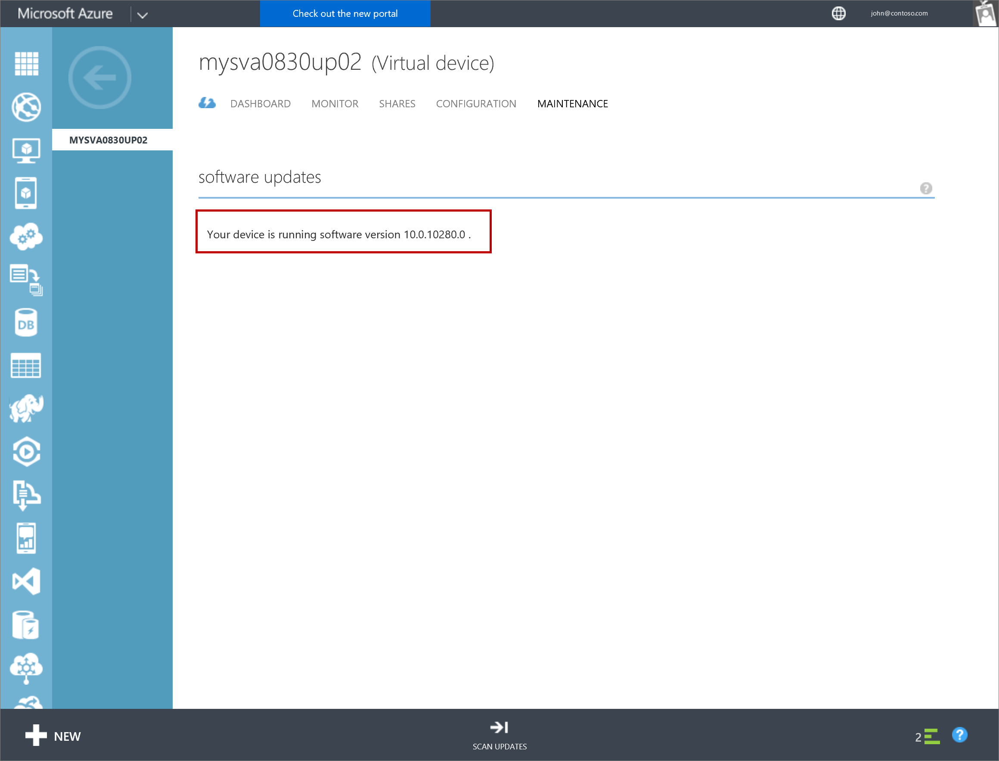
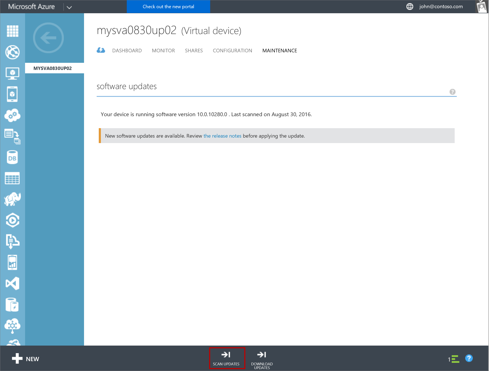
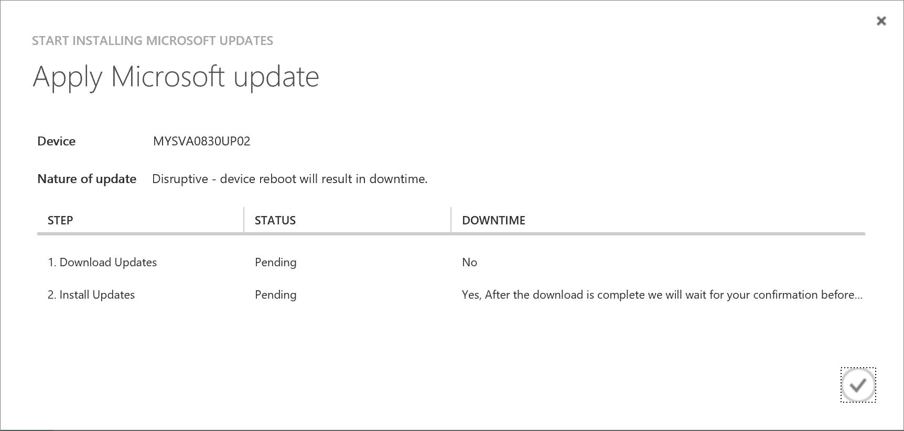
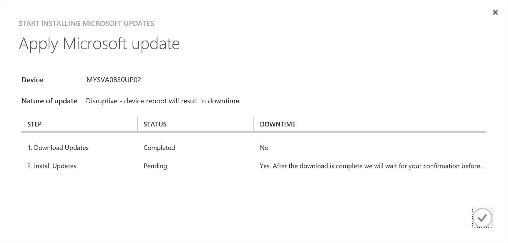
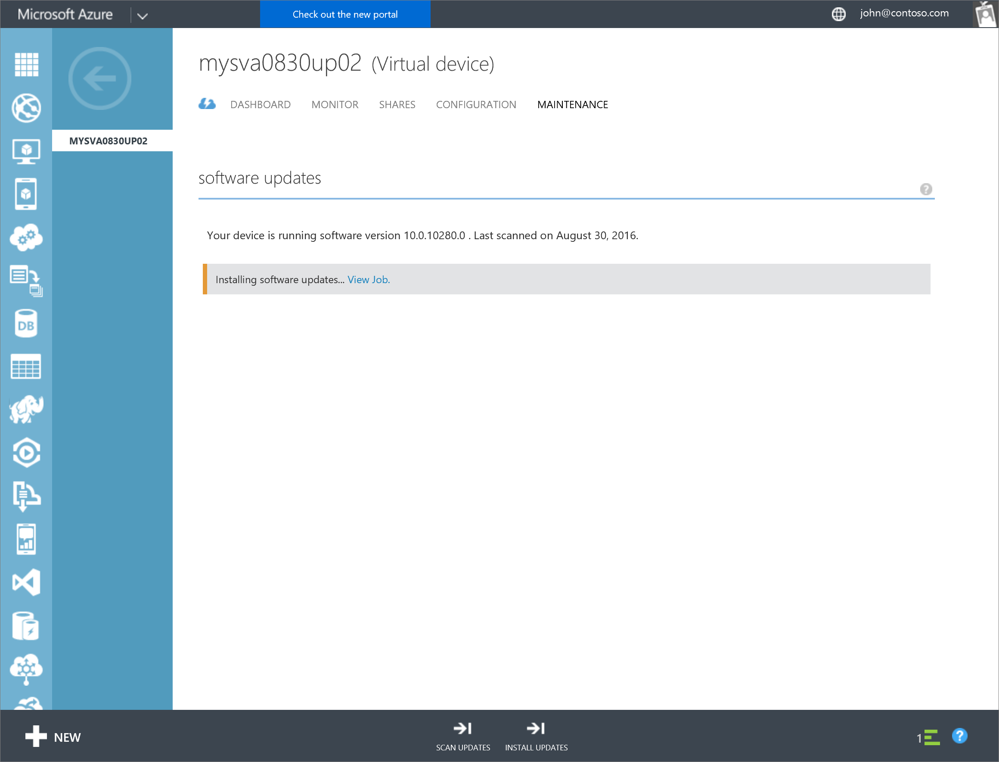
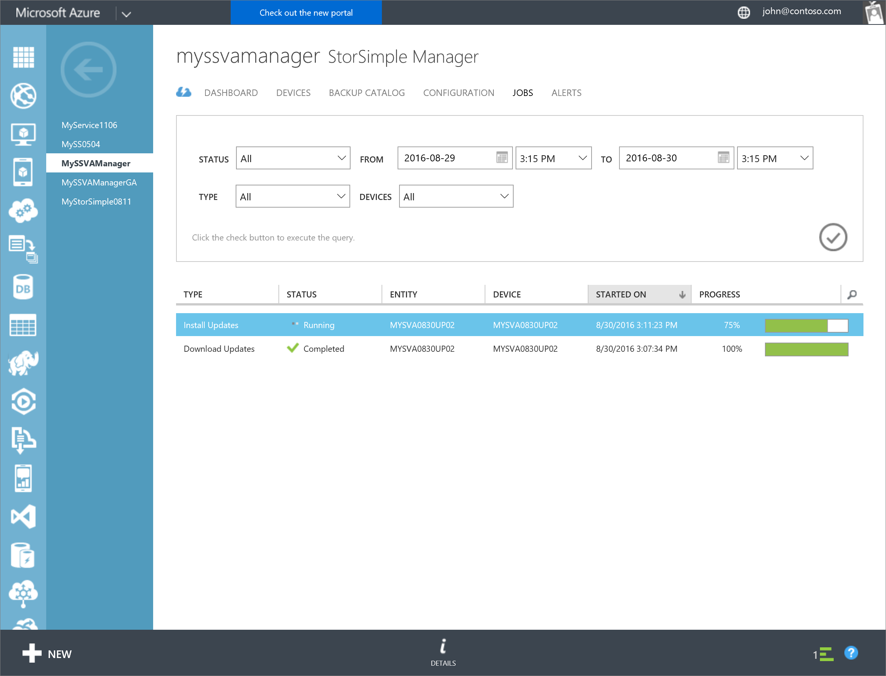

<!--author=alkohli last changed: 09/02/16 -->

#### To install updates via the Azure classic portal

1. On the **Devices** page, select the device on which you want to install updates.

2. Navigate to **Devices > Maintenance > Software Updates**.

      

3. You see a message if the software updates are available. To check for updates, you can also click **Scan Updates** at the bottom of the page.

    

4. From the bottom of the page, click **Download Updates**. A dialog notifies the user that the update is disruptive. Given the StorSimple Virtual Array is a single node device, the device restarts after it is updated. This disrupts any IO in progress. Click the check icon to launch a job to download the available updates. 

    

5. You are notified when the updates are downloaded. 

    

6. From the bottom of the page, click **Install Updates** to begin updating the device. The dialog is presented to you again. Click the check icon to start a job to install the updates. 

     

7. You are notified after the job is created. 

    

8. Click **View Job** link to go to the Jobs page and monitor the install status. You can click **Details** at any time to get detailed information about the update job. 

    