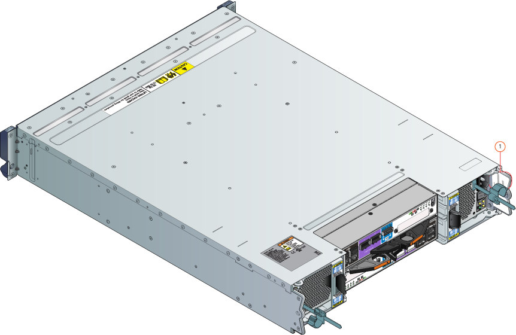

#### To attach the SAS cables
1. Identify the primary and the EBOD enclosures. The two enclosures can be identified by looking at their respective back planes. See the following image for guidance. 
   
    
   
    **Back view of primary and EBOD enclosures**
   
   | Label | Description |
   |:--- |:--- |
   | 1 |Primary enclosure |
   | 2 |EBOD enclosure |
2. Locate the serial numbers on the primary and the EBOD enclosures. The serial number sticker is affixed to the back ear of each enclosure. The serial numbers must be identical on both enclosures. [Contact Microsoft Support](../articles/storsimple/storsimple-8000-contact-microsoft-support.md) immediately if the serial numbers do not match. See the following illustration to locate the serial numbers.
   
    
   
    **Location of serial number sticker**
   
   | Label | Description |
   |:--- |:--- |
   | 1 |Ear of the enclosure |
3. Use the provided SAS cables to connect the EBOD enclosure to the primary enclosure as follows:
   
   1. Identify the four SAS ports on the primary enclosure and the EBOD enclosure. The SAS ports are labeled as EBOD on the primary enclosure and correspond to port A on the EBOD enclosure, as shown in the SAS cabling illustration, below.
   2. Use the provided SAS cables to connect the EBOD port to port A.
   3. The EBOD port on controller 0 should be connected to the port A on EBOD controller 0. The EBOD port on controller 1 should be connected to the port A on EBOD controller 1. See the following illustration for guidance. 
      
      
      
      **SAS cabling**
      
      | Label | Description |
      |:--- |:--- |
      | A |Primary enclosure |
      | B |EBOD enclosure |
      | 1 |Controller 0 |
      | 2 |Controller 1 |
      | 3 |EBOD Controller 0 |
      | 4 |EBOD Controller 1 |
      | 5, 6 |SAS ports on primary enclosure (labeled EBOD) |
      | 7, 8 |SAS ports on EBOD enclosure (Port A) |