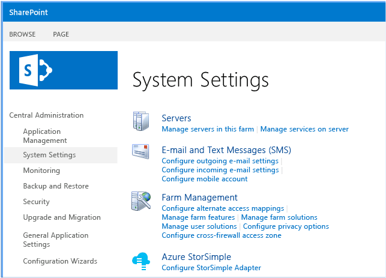
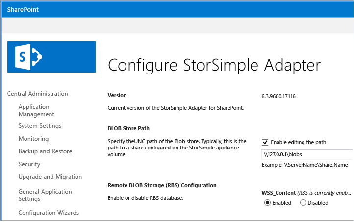
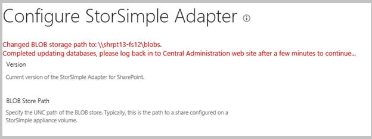
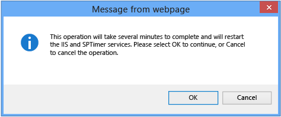

> [!NOTE]
> When making changes to the StorSimple Adapter for SharePoint RBS configuration, you must be logged on with a user account that belongs to the Domain Admins group. Additionally, you must access the configuration page from a browser running on the same host as Central Administration.
> 
> 

#### To configure RBS
1. Open the SharePoint Central Administration page, and browse to **System Settings**. 
2. In the **Azure StorSimple** section, click **Configure StorSimple Adapter**.
   
     
3. On the **Configure StorSimple Adapter** page:
   
   1. Make sure that the **Enable editing path** check box is selected.
   2. In the text box, type the Universal Naming Convention (UNC) path of the BLOB store.
      
      > [!NOTE]
      > The BLOB store volume must be hosted on an iSCSI volume configured on the StorSimple device.

   3. Click the **Enable** button below each of the content databases that you want to configure for remote storage.
      
      > [!NOTE]
      > The BLOB store must be shared and reachable by all web front-end (WFE) servers, and the user account that is configured for the SharePoint server farm must have access to the share.
      
      
      
      When you enable or disable RBS, you will also see the following message.
      
      

   4. Click the **Update** button to apply the configuration. When you click the **Update** button, the RBS configuration status will be updated on all WFE servers, and the entire farm will be RBS-enabled. The following message appears.
      
      
      
      > [!NOTE]
      > If you are configuring RBS for a SharePoint farm with a very large number of databases (greater than 200), the SharePoint Central Administration web page might time out. If that occurs, refresh the page. This does not affect the configuration process.

4. Verify the configuration:
   
   1. Sign in to the SharePoint Central Administration website, and browse to the **Configure StorSimple Adapter** page.
   2. Check the configuration details to make sure that they match the settings that you entered. 
5. Verify that RBS works correctly:
   
   1. Upload a document to SharePoint. 
   2. Browse to the UNC path that you configured. Make sure that the RBS directory structure was created and that it contains the uploaded object.
6. (Optional) You can use the Microsoft RBS `Migrate()` PowerShell cmdlet included with SharePoint to migrate existing BLOB content to the StorSimple device. For more information, see [Migrate content into or out of RBS in SharePoint 2013][6] or [Migrate content into or out of RBS (SharePoint Foundation 2010)][7].
7. (Optional) On test installations, you can verify that the BLOBs were moved out of the content database as follows: 
   
   1. Start SQL Management Studio.
   2. Run the ListBlobsInDB_2010.sql or ListBlobsInDB_2013.sql query, as follows.
      
      ```
      **ListBlobsInDB_2013.sql**
      
        USE WSS_Content
        GO
      
        SELECT DocStreams.DocId,
      
               LeafName AS Name,
               Content,
               AllDocs.Size AS OrigSizeOfContent,
               LEN(CAST(Content AS VARBINARY(MAX))) AS SizeOfContentInDB,
               DocStreams.RbsId,
               TimeLastModified
      
        FROM DocStreams
      
             INNER JOIN AllDocs ON DocStreams.DocId = AllDocs.Id
        ORDER BY TimeLastModified DESC
        GO
      
      **ListBlobsInDB_2010.sql**
      
        USE WSS_Content
        GO
      
        SELECT AllDocStreams.Id,
      
               LeafName AS Name,
               Content,
               AllDocs.Size AS OrigSizeOfContent,
               LEN(CAST(Content AS VARBINARY(MAX))) AS SizeOfContentInDB,
               RbsId,
               TimeLastModified
        FROM AllDocStreams
      
             INNER JOIN AllDocs ON AllDocStreams.Id = AllDocs.Id
        ORDER BY TimeLastModified DESC
        GO
      ```
      
      If RBS was configured correctly, a NULL value should appear in the SizeOfContentInDB column for any object that was uploaded and successfully externalized with RBS.
8. (Optional) After you configure RBS and move all BLOB content to the StorSimple device, you can move the content database to the device. If you choose to move the content database, we recommend that you configure the content database storage on the device as a primary volume. Then, use established SQL Server best practices to migrate the content database to the StorSimple device. 
   
   > [!NOTE]
   > Moving the content database to the device is only supported for the StorSimple 8000 series (it is not supported for the 5000 or 7000 series).
   
   If you store BLOBs and the content database in separate volumes on the StorSimple device, we recommend that you configure them in the same volume container. This ensures that they will be backed up together.
   
   > [!WARNING]
   > If you have not enabled RBS, we do not recommend moving the content database to the StorSimple device. This is an untested configuration.
   
9. Go to the next step: [Configure garbage collection](#configure-garbage-collection).

[6]: https://technet.microsoft.com/library/ff628254(v=office.15).aspx
[7]: https://technet.microsoft.com/library/ff628255(v=office.14).aspx
