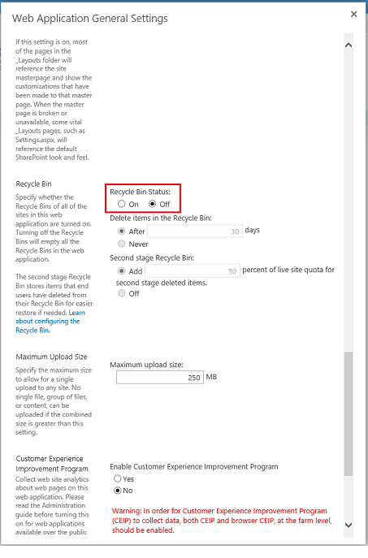

<properties 
   pageTitle="StorSimple Adapter for SharePoint - garbage collection | Microsoft Azure"
   description="Describes how to delete BLOBs immediately when using StorSimple Adapter for SharePoint."
   services="storsimple"
   documentationCenter="NA"
   authors="SharS"
   manager="carolz"
   editor="" />
<tags 
   ms.service="storsimple"
   ms.devlang="NA"
   ms.topic="article"
   ms.tgt_pltfrm="NA"
   ms.workload="TBD"
   ms.date="07/10/2015"
   ms.author="v-sharos" />

In this procedure, you will:

1. [Prepare to run the Maintainer executable](#to-prepare-to-run-the-maintainer) .

2. [Prepare the content database and Recycle Bin for immediate deletion of orphaned BLOBs](#to-prepare-the-content-database-and-recycle-bin-to-immediately-delete-orphaned-blobs).

3. [Run Maintainer.exe](#to-run-the-maintainer).

4. [Revert the content database and Recycle Bin settings](#to-revert-the-content-database-and-recycle-bin-settings).

#### To prepare to run the Maintainer

1. On the Web front-end server, open the SharePoint 2013 Management Shell as an administrator.

2. Navigate to the folder <boot drive>:\Program Files\Microsoft SQL Remote Blob Storage 10.50\Maintainer\.

3. Rename **Microsoft.Data.SqlRemoteBlobs.Maintainer.exe.config** to **web.config**.

4. Use `aspnet_regiis -pdf connectionStrings` to decrypt the web.config file.

5. In the decrypted web.config file, under the **<connectionStrings>** node, add the connection string for your SQL server instance and the content database name. See the following example.

    `<add name=”RBSMaintainerConnectionWSSContent” connectionString="Data Source=SHRPT13-SQL12\SHRPT13;Initial Catalog=WSS_Content;Integrated Security=True;Application Name=&quot;Remote Blob Storage Maintainer for WSS_Content&quot;" providerName="System.Data.SqlClient" />`

6. Use `aspnet_regiis –pef connectionStrings` to re-encrypt the web.config file. 

7. Rename web.config to Microsoft.Data.SqlRemoteBlobs.Maintainer.exe.config. 

#### To prepare the content database and Recycle Bin to immediately delete orphaned BLOBs

1. On the SQL Server, in SQL Management Studio, run the following update queries for the target content database: 

       `use WSS_Content`

       `exec mssqlrbs.rbs_sp_set_config_value ‘garbage_collection_time_window’ , ’time 00:00:00’`

       `exec mssqlrbs.rbs_sp_set_config_value ‘delete_scan_period’ , ’time 00:00:00’`

2. On the web front-end server, under **Central Administration**, edit the **Web Application General Settings** for the desired content database to temporarily disable the Recycle Bin. This action will also empty the Recycle Bin for any related site collections. To do this, click **Central Administration** -> **Application Management** -> **Web Applications (Manage web applications)** -> **SharePoint - 80** -> **General Application Settings**. Set the **Recycle Bin Status** to **OFF**.

    

#### To run the Maintainer

- On the web front-end server, in the SharePoint 2013 Management Shell, run the Maintainer as follows:

      `Microsoft.Data.SqlRemoteBlobs.Maintainer.exe -ConnectionStringName RBSMaintainerConnectionWSSContent -Operation GarbageCollection -GarbageCollectionPhases rdo`

    >[AZURE.NOTE] Only the `GarbageCollection` operation is supported for StorSimple at this time. Also note that the parameters issued for Microsoft.Data.SqlRemoteBlobs.Maintainer.exe are case sensitive. 
 
#### To revert the content database and Recycle Bin settings

1. On the SQL Server, in SQL Management Studio, run the following update queries for the target content database:

      `use WSS_Content`

      `exec mssqlrbs.rbs_sp_set_config_value ‘garbage_collection_time_window’ , ‘days 30’`

      `exec mssqlrbs.rbs_sp_set_config_value ‘delete_scan_period’ , ’days 30’`

      `exec mssqlrbs.rbs_sp_set_config_value ‘orphan_scan_period’ , ’days 30’`

2. On the web front-end server, in **Central Administration**, edit the **Web Application General Settings** for the desired content database to re-enable the Recycle Bin. To do this, click **Central Administration** -> **Application Management** -> **Web Applications (Manage web applications)** -> **SharePoint - 80** -> **General Application Settings**. Set the Recycle Bin Status to **ON**.
