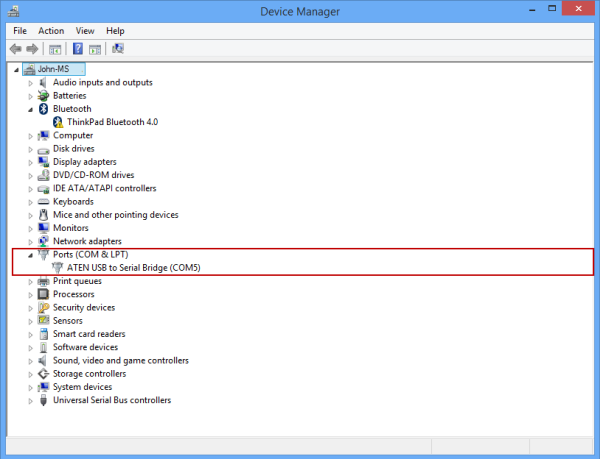
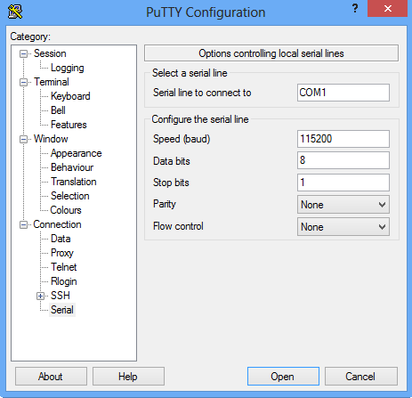

#### To connect through the serial console
1. Connect your serial cable to the device (directly or through a USB-serial adapter).
2. Open the **Control Panel**, and then open the **Device Manager**.
3. Identify the COM port as shown in the following illustration.
   
     
4. Start PuTTY. 
5. In the right pane, change the **Connection type** to **Serial**.
6. In the right pane, type the appropriate COM port. Make sure that the serial configuration parameters are set as follows:
   
   * Speed: 115,200
   * Data bits: 8
   * Stop bits: 1
   * Parity: None
   * Flow control: None
     
     These settings are shown in the following illustration.
     
      
     
     > [!NOTE]
     > If the default flow control setting does not work, try setting the flow control to XON/XOFF.
     > 
     > 
7. Click **Open** to start a serial session.

