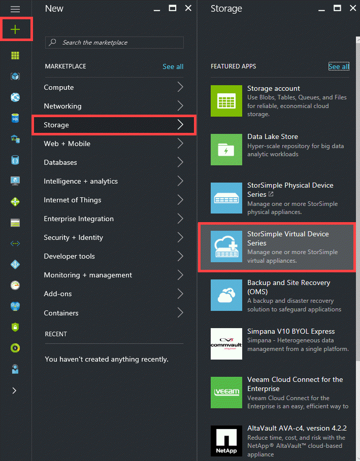
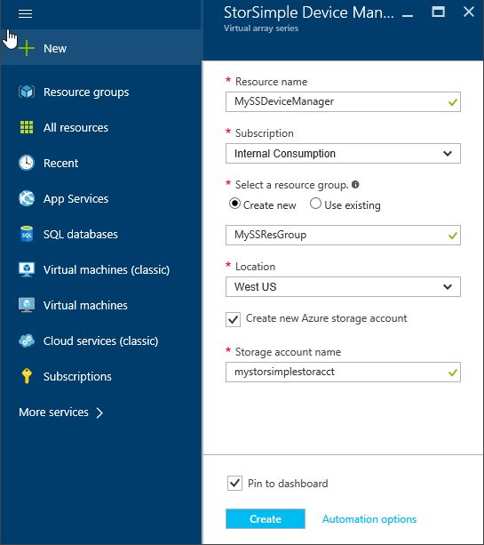

#### To create a new service

1.  Using your Microsoft account credentials, sign in to the Azure portal at this URL: <https://portal.azure.com/>. If deploying the device in Government portal, sign in at: <https://portal.azure.us/>

2.  In the Azure portal, click **+ Create a resource** &gt; **Storage** &gt; **StorSimple Virtual Series**.

     

3.  In the **StorSimple Device Manager** blade that opens up, do the following:

    1.  Supply a unique **Resource name** for your service. The resource name is a friendly name that can be used to identify the service. The name can have between 2 and 50 characters that can be letters, numbers, and hyphens. The name must start and end with a letter or a number.

    2.  Choose a **Subscription** from the drop-down list. The subscription is linked to your billing account. This field is not present if you have only one subscription.

    3.  For **Resource group**, select an existing or create a new group. For more information, see [Azure resource groups](https://azure.microsoft.com/documentation/articles/virtual-machines-windows-infrastructure-resource-groups-guidelines/).

    4.  Supply a **Location** for your service. See [Azure Regions](https://azure.microsoft.com/regions/#services) for more information about which services are available in which region. In general, choose a **Location** closest to the geographical region where you want to deploy your device. You may also want to factor in the following:

        -   If you have existing workloads in Azure that you also intend to deploy with your StorSimple device, we recommend that you use that datacenter.

        -   Your StorSimple Device Manager and Azure storage can be in two separate locations. In such a case, you are required to create the StorSimple Device Manager and Azure storage account separately. To create an Azure storage account, navigate to Azure Storage in the Azure portal and follow the steps described in [Create a storage account](https://docs.microsoft.com/azure/storage/common/storage-quickstart-create-account). After you create this account, add it to the StorSimple Device Manager service by following the steps in [Configure a new storage account for the service](https://azure.microsoft.com/documentation/articles/storsimple-deployment-walkthrough/#configure-a-new-storage-account-for-the-service).

        -   If deploying the virtual device in the Government Portal, the StorSimple Device Manager service is available in US Iowa and US Virginia locations.

    5.  Select **Create a new Azure storage account** to automatically create a storage account with the service. Specify a **Storage account name**. If you need your data in a different location, uncheck this box.

    6.  Check **Pin to dashboard** if you want a quick link to this service on your dashboard.

    7.  Click **Create** to create the StorSimple Device Manager.

          

You are directed to the **Service** landing page. The service creation takes a few minutes. After the service is successfully created, you will be notified appropriately and the status of the service will change to **Active**.

