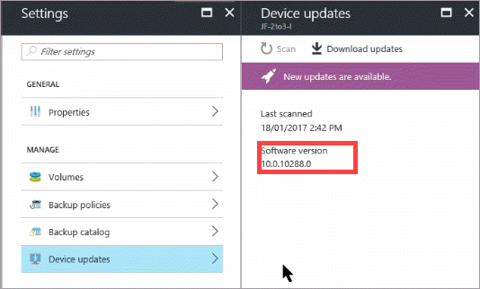
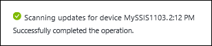
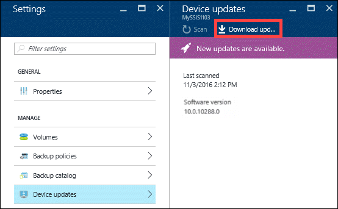
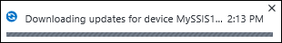
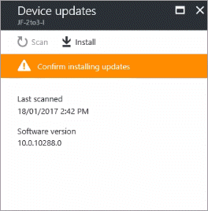
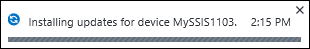
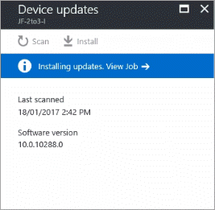
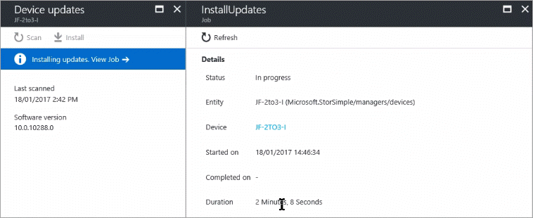

#### To install updates via the Azure portal

1. Go to your StorSimple Device Manager and select **Devices**. From the list of devices connected to your service, select and click the device you want to update. 

     

2. In the **Settings** blade, click **Device updates**. 

      

3. You see a message if the software updates are available. To check for updates, you can also click **Scan**.

    

    You will be notified when the scan starts and completes successfully.

    

4. Once the updates are scanned, click **Download updates**. 

    

5. In the **New updates** blade, review the information that after the updates are downloaded, you need to confirm the installation. Click **OK**.

    

6. You are notified when the upload starts and completes successfully.

     

5. In the **Device updates** blade, click **Install**.

        

6. In the **New updates** blade, you are warned that the update is disruptive. As virtual array is a single node device, the device restarts after it is updated. This disrupts any IO in progress. Click **OK** to install the updates. 

     

7. You are notified when the install job starts. 

    

8.  After the install job completes successfully, click **View Job** link in the **Device updates** blade to monitor the installation. 

    

    This takes you to the **Install Updates** blade. You can view detailed information about the job here.

    

9. After the updates are successfully installed, you see a message to this effect in the **Device updates** blade. 
