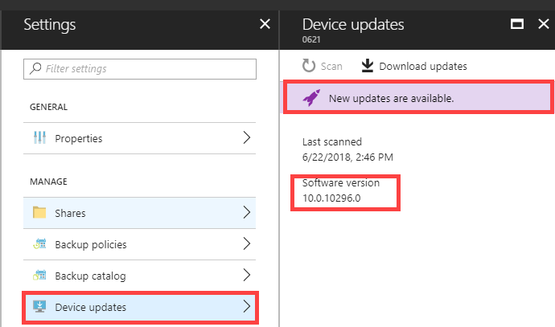
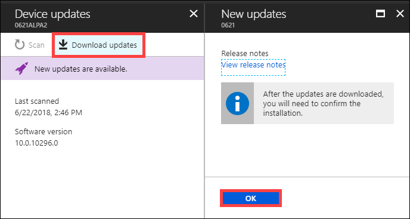
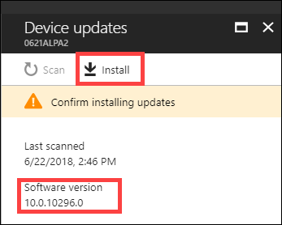
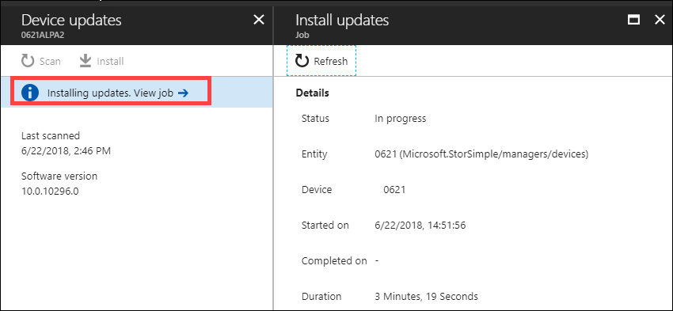

#### To install updates via the Azure portal

1. Go to your StorSimple Device Manager and select **Devices**. From the list of devices connected to your service, select and click the device you want to update.

2. Under **Settings**, click **Device updates**.  

3. You see a message if the software updates are available. To check for updates, you can also click **Scan**. Make a note of the software version you are running. 

    

    You are notified when the scan starts and completes successfully.
 
4. Once the updates are scanned, click **Download updates**. Under **New updates**, review the release notes. Also note that after the updates are downloaded, you need to confirm the installation. Click **OK**.

    

    You are notified when the upload starts and completes successfully.

5. Under **Device updates**, click **Install**.

     

6. Under **New updates**, you are warned that the update is disruptive. As virtual array is a single node device, the device restarts after it is updated. This disrupts any IO in progress. Click **OK** to install the updates.

    

    You are notified when the install job starts.

7.  After the install job completes successfully, click **View Job** link. This action takes you to the **Install Updates** blade. You can view detailed information about the job here. 

    

8. If you started with a virtual array running software version Update 1 (10.0.10296.0), you are now running Update 1.1 and are done. You can skip the remaining steps. 

    If you started with a virtual array running software version Update 0.6 (10.0.10293.0), you are now updated to Update 1.0. You see another message indicating that updates are available. Repeat steps 4-7 to install Update 1.1.

    

