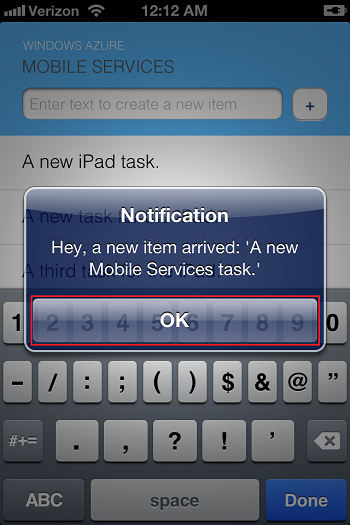

* In Xcode, press **Run** and start the app on an iOS device (not the simulator.) Click **OK** to accept push notifications; this request occurs the first time the app runs.

* In the app, add a new item and click **+**.

* Verify that a notification is received, then click **OK** to dismiss the notification. You have now successfully completed this tutorial.

  	
