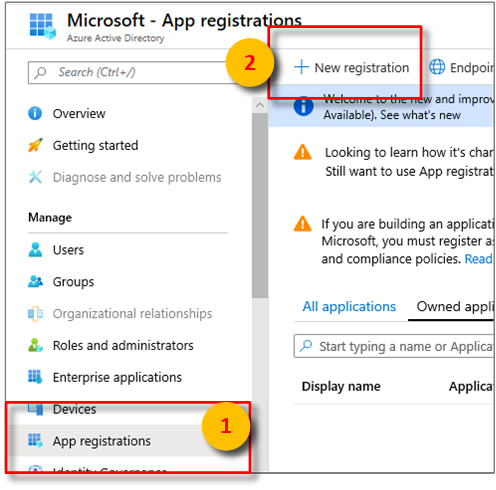
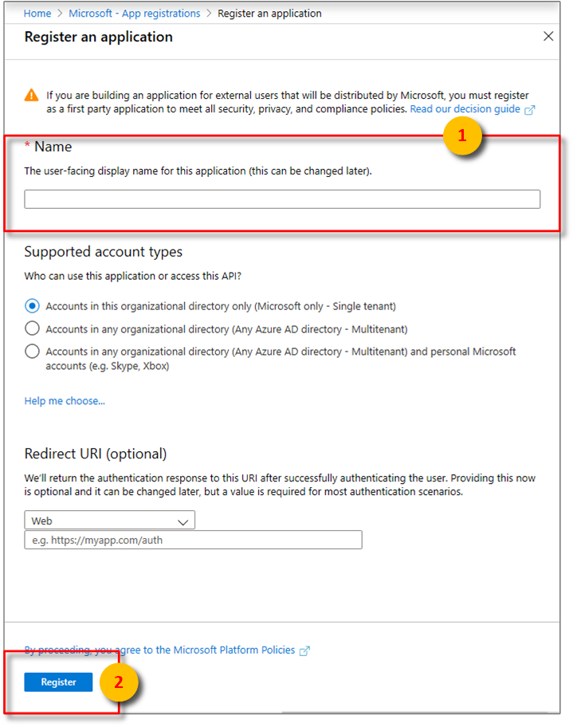
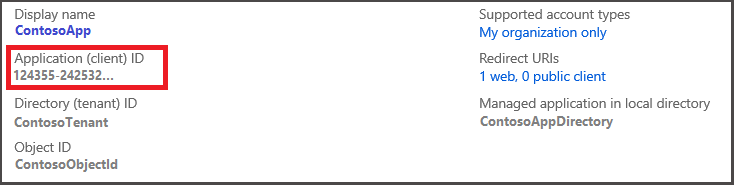
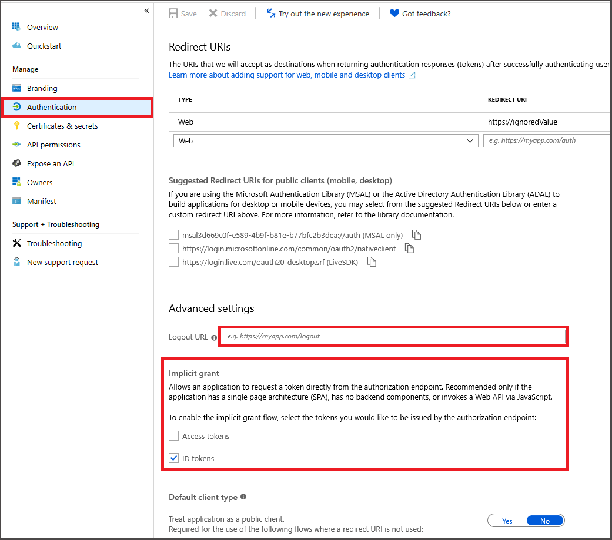
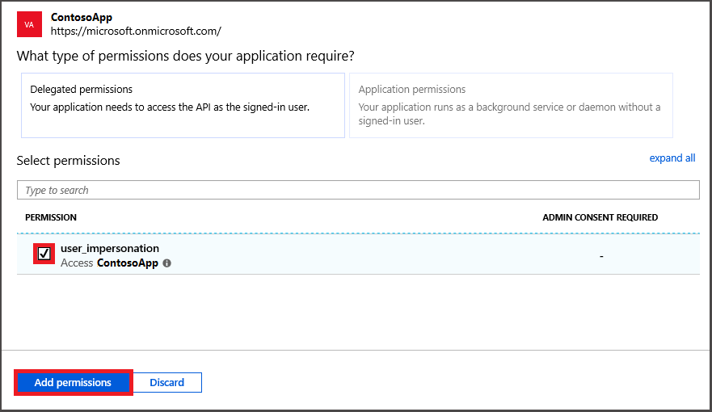

> [!IMPORTANT]
> * The new **Azure Active Directory** > **App registrations** blade replaces the legacy **Azure Active Directory** > **App registrations (Legacy)** blade May 2019.
> * App registrations created or displayed in the legacy blade will automatically appear in the new blade.
> * For comprehensive information about migrating to the new Azure App registration experience, read the [Azure App registrations training guide](https://docs.microsoft.com/azure/active-directory/develop/app-registrations-training-guide) and [Azure Active Directory Quickstart](https://docs.microsoft.com/azure/active-directory/develop/quickstart-register-app).

1. In the [Azure portal](https://ms.portal.azure.com/), select **Azure Active Directory** > **App registrations** > **New registration**.

   

   > [!TIP]
   > The new Azure Active Directory App registration panel allows you to filter the displayed apps by selecting **Owned applications**.

    Your app will be listed here after you register it.

1. Give the application a name and select **Accounts in this organizational directory only** to specify the **Supported account types** that may access the API. Choose a valid URI  to redirect users to after they authenticate, then **Register**.

   

1. Important Azure Active Directory app information is displayed in your listed app's **Overview** blade. Select your app under **Owned applications**, then **Overview**.

   

   Copy your **Application (client) ID** to use in your client application.

1. The **Authentication** blade specifies important authentication configuration settings. 

    1. **Redirect URIs** must match the address supplied by the authentication request:

        * For apps hosted in a local development environment, select **Public client (mobile & desktop)**. Make sure to set the **Default client type** to yes.
        * For Single-Page apps hosted on Azure App Service, select **Web**.

    1. Enable the implicit grant flow by checking **ID tokens**.

   

   Click **Save**.

1. Associate your Azure Active Directory app Azure TIme Series Insights. Select **API permissions** > **Add a permission** > **APIs my organization uses**. 

    

   Type `Azure Time Series Insights` into the search bar then select `Azure Time Series Insights`.

1. Next, specify the kind API permission your app requires. By default, **Delegated permissions** will be highlighted. Choose a permission type then, select **Add permissions**.

    