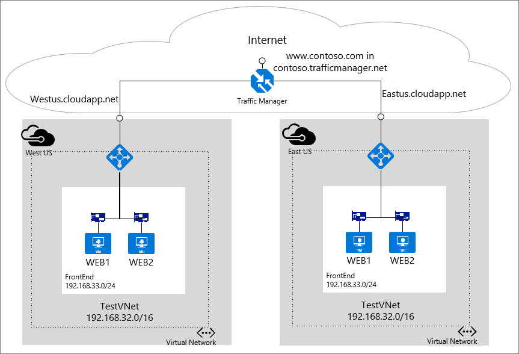

## Scenario

The scenario below configures a traffic manager profile called contoso.trafficmanager.net using a CNAME www.contoso.com. The scenario shows two endpoints to explain how traffic manager uses them.  The first endpoint is named westus.cloudapp.net and second endpoint is named eastus.cloudapp.net. For the example, it uses only cloud services but you can see different endpoint types for a Traffic Manager configuration. After you create a traffic manager profile, you can [add endpoints for traffic manager profle](traffic-manager-get-started-create-endpoint-arm-portal.md). You can also combine different endpoint types (cloud services, web apps or external endpoints) in a traffic manager profile.

The steps for the scenario covers only the traffic manager profile creation. It assumes the endpoint deployment for westus.cloudapp.net and eastus.cloudapp.net already exist.

 
